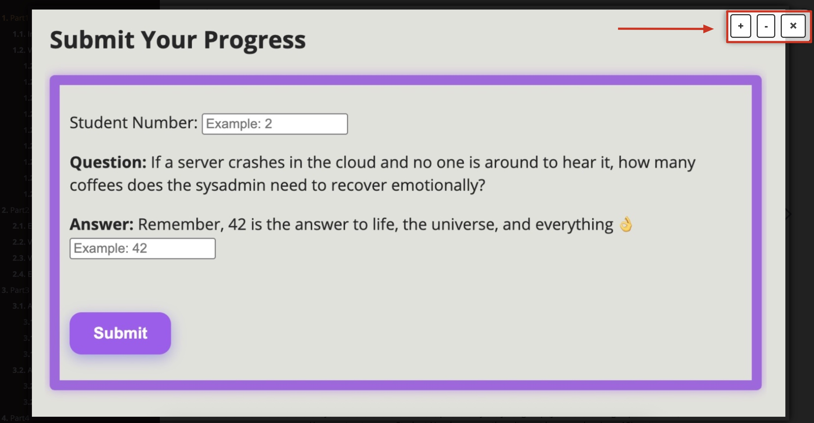
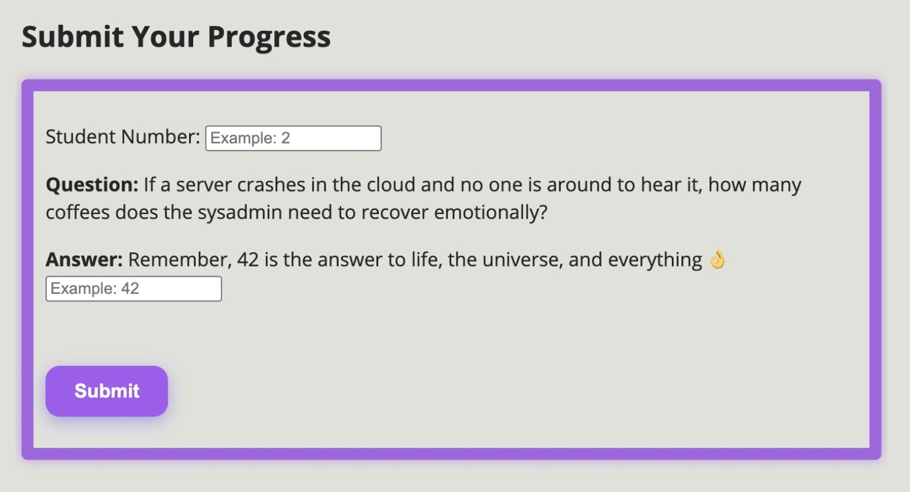

# Introduction

Welcome helldiver, our world is under attack, and we need your help in defending it. 

Let’s set the scene:

Attackers are trying to disrupt public transport in preparation of a global attack. As you just saw, they managed to do it Belgium. Learn from what they did and build defenses, so it won’t happen again. This may be an exercise. But be aware if you fail there will be consequences. 

We will split up into **groups of 2**. Where one of you do the attack and the other will build the defenses.

The mission is clear, **use Exclusive Networks top notch portfolio to detect/block all stages of the attack**. 

## Rules of engagement

 

**Helldivers, you must not engage in any attacks or interference with the environments, accounts, or machines of your fellow defenders**. Stay focused on your mission—our true enemy lies beyond our ranks.

 

**Under no circumstances should you target or interfere with machines that are not part of the designated attack and defend flow**. Our battle is with the enemy, not with neutral or unassigned systems.

 

**Stay vigilant, stay disciplined, and keep your sights set on the real threat.**

 

# Welcome to the Lab Guide!

Welcome to our interactive Lab Guide, built to make your learning experience as smooth and efficient as possible!

In this guide, you’ll find a clear, step-by-step structure to help you navigate through the labs easily. Whether you’re following the theory or jumping into hands-on exercises, everything is organized to support you every step of the way.

## Key Features:
**Easy Navigation**:
Quickly move between different sections and chapters using the menu on the left. You can always jump back and forth without losing track of where you are.

**One-Click Copy**:
For every command you see in this Lab Guide, you can copy it with a single click — no need to manually select and copy. This way, you avoid mistakes and speed up your lab work.

**Clickable Images**:
Whenever you see an image, you can click on it to enlarge it to full screen! This makes it much easier to view details, diagrams, screenshots, and more without squinting. You can also zoom in and zoom out using the button in the top-right corner.

**Practical Layout**:
Commands, screenshots, explanations, and tips are all embedded directly into the guide to keep everything centralized and easy to access — no flipping between different windows or documents!

# Cyberhell Activity Tracker

This tracker allows your group to record your progress as you move through the activities.
**Please read the instructions carefully to avoid missing out on points!**

### How It Works

- Each activity includes one question you must answer.
- Pay close attention to the tips provided — including the required answer format (case-sensitive in some cases).
- Only one submission is allowed per activity for your group (you are working in pairs — duo).
- You must enter your Student Number correctly — it must be a number (e.g., 12), not your name.

One submission per activity and the answers must follow the correct format — case-sensitive where indicated.

If you encounter any issue, please contact an instructor immediately. We’re here to help!

## Bonus Challenge – Scoreboard!

To make things a little more exciting:

- The first 3 groups to submit a correct answer will receive +3 bonus points. 🎉

- All other groups who submit successfully will still earn +1 point for their effort. 👏

**Good luck!** 🚀