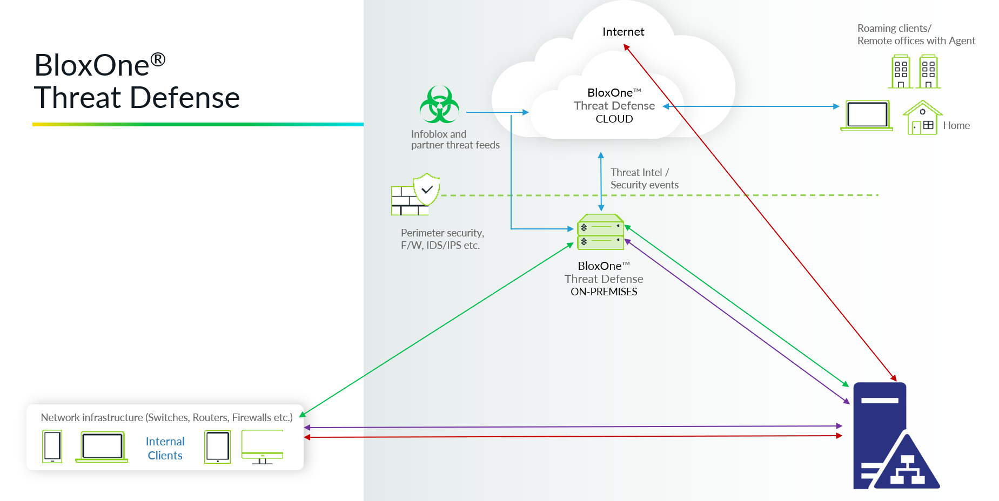
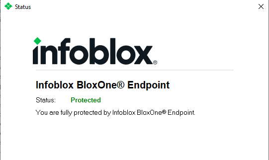
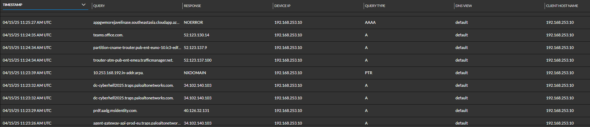
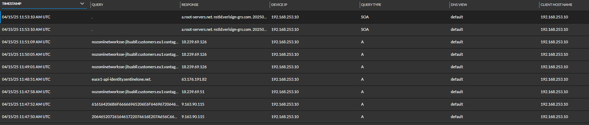

# Infoblox BloxOne

> Stopping DNS Exfiltration in the Cyberhell Battlefield

Infoblox BloxOne is a cloud-native DNS security solution that detects and blocks malicious DNS activity, including data exfiltration, malware communication, and phishing attempts. 

In Cyberhell, we use BloxOne to prevent attackers from exfiltrating stolen data over DNS—one of the most stealthy and widely abused attack techniques.

---

# Block DNS Exfiltration with Infoblox BloxOne

It's time to reveal how we can **protect our environment against DNS exfiltration**.
You have 3 ways to protect yourself with Infoblox BloxOne

1. You are a **Roaming clients**

    - In this case you install the BloxOne `Agent` on your end device:
    your DNS traffic will be forwarded to the `BloxOne Threat Defense CLOUD `  
    
    
    

1. You are an **internal client** and use MS Active Directory or another internal DNS server and **forward all DNS to Infoblxo BloxOne**. 

    - In this case you configure your forwarder on your Internal DNS server (AD or a other DNS server) to your **internal BloxOne Threat Defense ON-PREMISES**. 
    - This solution has the advantage that it is easy to implement without downtime. 
    - The drawback to this solution is that the log file in your BloxOne will only have one source address for all your DNS requests, as the DC is the only one who will forward all the DNS traffic.

    

1. You are an **internal client** and use **Infoblox BloxOne as Internal DNS server**. 

    - In this case your clients forward all their DNS traffic to internal BloxOne Threat Defense ON-PREMISES. 
    - This solution has the advantage that the log file in your BloxOne has richer data in it.
    - The drawback to this solution is that you have to configure your active directory as an internal domain or you will break your internal DNS. 

    
    

We have configured option 3 in this Cyberhell environment.

### Key Capabilities in Cyberhell

DNS-Based Threat Detection
- Identifies and stops DNS tunneling, C2 traffic, and data exfiltration
- Uses Threat Intelligence feeds and machine learning to detect anomalies

Automated DNS Security Policies
- Blocks or restricts access to malicious domains
- Enforces strict security policies to prevent misuse of DNS

Real-Time Visibility & Reporting
- Monitors all DNS queries, spotting suspicious patterns
- Provides detailed logs and alerts in Security Activity reports

Cloud-Native & Scalable
- Protects DNS traffic on-prem, in the cloud, and remote locations
- Integrates with SIEMs & SOAR for automated threat response

Zero Trust DNS Protection
- Enforces adaptive access controls for users and devices
- Only allows authorized DNS queries, blocking threats before they spread

---

### Why It Matters in Cyberhell?
Attackers in Cyberhell are relentless—they try to exfiltrate stolen data over DNS to evade detection. BloxOne DNS Security is our first line of defense, stopping them before the data leaves our network.
 
✅ Detects and blocks data exfiltration attempts
 
✅  Stops DNS tunneling techniques used by advanced attackers
 
✅ Ensures our DNS is secure and not weaponized by the enemy

----

How We Use It in the Workshop
1. Simulate a DNS data exfiltration attack
1. Use Infoblox BloxOne to detect the malicious traffic
1. Analyze security logs to see attack details
1. Deploy security policies to BLOCK exfiltration attempts
1. Re-run the attack and confirm that it is now blocked

----

Learn More & Get Started
Portal Access: [Infoblox Portal](https://csp.infoblox.com/)