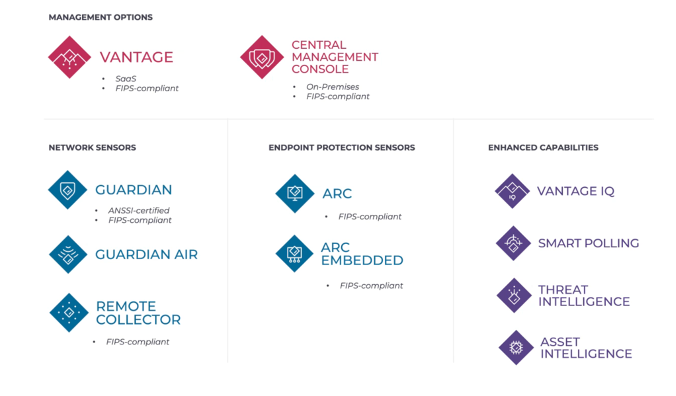
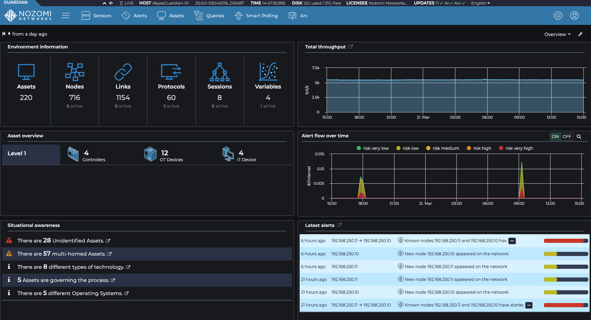
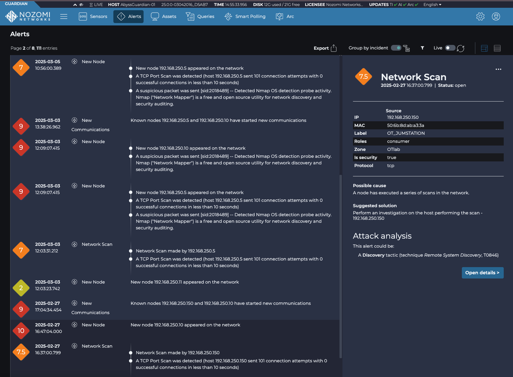
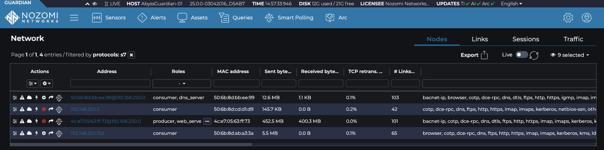

# Nozomi Networks
The Nozomi Guardian sensor provides passive network monitoring by connecting to a SPAN (or mirror) port on a switch or firewall. It can also receive traffic via TAP, RSPAN or ERSPAN for remote monitoring. Once connected, the Guardian inspects the mirrored traffic using deep packet inspection (DPI) to extract valuable information about the operational technology (OT) and Industry Of Things (IOT) environment.

One or more Guardian sensors can forward their analyzed data to Nozomi Vantage, a SaaS-based platform that centralizes visibility and provides advanced analytics, threat detection, and contextual asset enrichment.

### Key Capabilities

- **Asset Visibility** 
 Guardian passively discovers assets by monitoring network traffic, even identifying devices that aren’t actively communicating.

- **Deep Packet Inspection**
  Detailed traffic analysis allows enrichment of asset profiles with protocol-level data and behavior insights.

- **Threat Detection** 
 Guardian identifies anomalous or malicious traffic patterns to detect threats targeting OT networks.

 

# Nozomi Networks  in the Cyberhell Workshop
In Cyberhell, **Nozomi Guardian** is deployed to monitor the OT network, providing critical visibility into industrial devices and communications. It plays a key role in detecting the attack on the PLC, helping defenders understand the scope and impact of the intrusion.

Guardian is the elite sensor which you will connect to a SPAN port. However, this is not the only sensor, you can also choose for a more lightweight sensor such as a **Remote collector**, **Guardian Air** for wireless connections or the **Arc agent** which can be installed on workstations.

All this information can be sent to the 2 management options.

- **Vantage**: SaaS Cloud portal
- **Central Management Console** (CMC): hardware/software on-premise appliance

 

Within the **Guardian** you will see immediately what’s happening inside your network.

- The number of assets, nodes, links, protocols, sessions and variables
- You will see the latest alerts
- You will see the total throughput being sent to the Guardian
- You will see situational awareness (links to the internet, devices which are both in IT and OT…)

Within **Vantage** you will see in one glimpse what’s happening across all your different sites. All the sensors will be sending data towards this SaaS platform. This can be done either directly or via the CMC.

----

Even though Nozomi has different products, the look and feel is the same for all their products. This makes sure you only need to get to know 1 dashboard for all the different products.

This unexpected S7 traffic was also instantly discovered by the Nozomi networks Guardian. 

