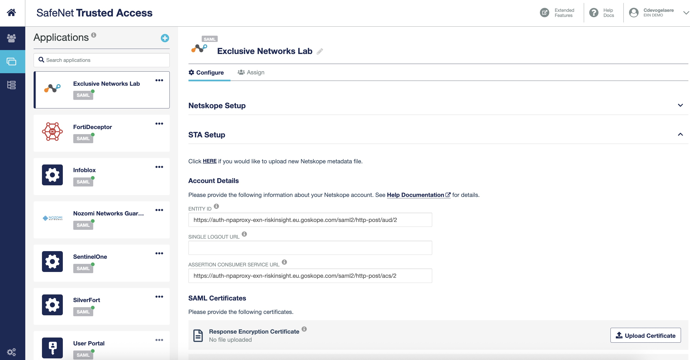
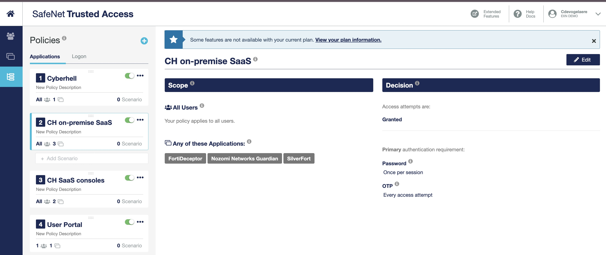
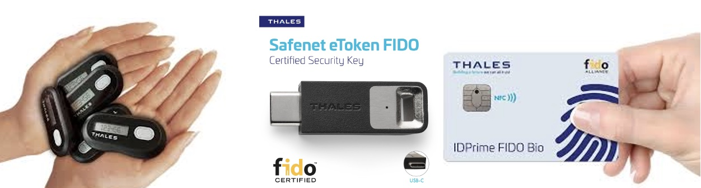

# **Thales SafeNet Trusted Access**  

###  **Overview**  
**Thales SafeNet Trusted Access (STA)** is a **secure and trusted Identity Provider (IDP)** designed to enforce strong authentication and access management. It provides **Single Sign-On (SSO)** capabilities, enabling seamless yet secure access to critical applications.  

Thales stands apart by **designing and manufacturing its own hardware and software tokens**, ensuring full control over security and authentication mechanisms.  

### **Key Capabilities**  

- **Identity & Access Management (IAM):** Acts as a **centralized IDP** for secure authentication.  
- **Single Sign-On (SSO):** Enables users to access multiple applications with a single authentication flow.  
- **Multi-Factor Authentication (MFA):** Policies can enforce MFA based on specific scenarios, including:  
  - **Source location** (e.g., allow/block based on country or IP range).  
  - **Operating System** (e.g., restrict access from untrusted OS).  
  - **Device Type** (e.g., enforce stronger authentication on unmanaged devices).  
  - **Risk-based authentication** for adaptive security.  

### **Use in the Cyberhell Workshop**  
In **Cyberhell**, **Thales SafeNet Trusted Access** is used as the **IDP** to control access to:  
- **Private applications** within the secured environment.  
- **Cybersecurity SaaS consoles**, enforcing authentication security at every step.  

> SafeNet Trusted Access Applications

> SafeNet Trusted Access Access Policies

 

### **Authentication Methods Used**  
For this workshop, only **hardware-based authentication** will be used:  

1. **Hardware OTP 110** – Event-based **One-Time Password (OTP) token**.  

1. **FIDO2 USB-C Security Key** – **Passwordless authentication** with strong cryptographic security.
  
    FIDO2 Security Keys, manufactured by Thales, ensure that access remains **highly secure**, **phishing-resistant**, and **immune to software-based attacks**.  

    

 

# **Thales Data Security Platform**  
Data security is the **#1 priority** for organizations. **Thales CPL (Cloud Protection & Licensing)** provides a **comprehensive data security platform** to protect **sensitive data and communications**.

- **Encryption Key Management:** Securely store and manage encryption keys.  
- **Hardware Security Modules (HSMs):** Keys can be stored in **Luna HSMs**, ensuring **high-assurance protection** against cyber threats.  
- **Centralized Key Management:** Maintain control over encryption keys across cloud, on-prem, and hybrid environments.  
- **Bring Your Own Key (BYOK):** Instead of relying on a **cloud provider’s** key management system, organizations can **keep their encryption keys in their own Luna HSM**—rather than in **a spreadsheet** (which, let’s be honest, is a disaster waiting to happen).

 

## **Learn More**  
🔗 [**Thales SafeNet Trusted Access**](https://cpl.thalesgroup.com/access-management/safenet-trusted-access)  
🔗 [**Thales Data Security Platform**](https://cpl.thalesgroup.com/data-protection)  
