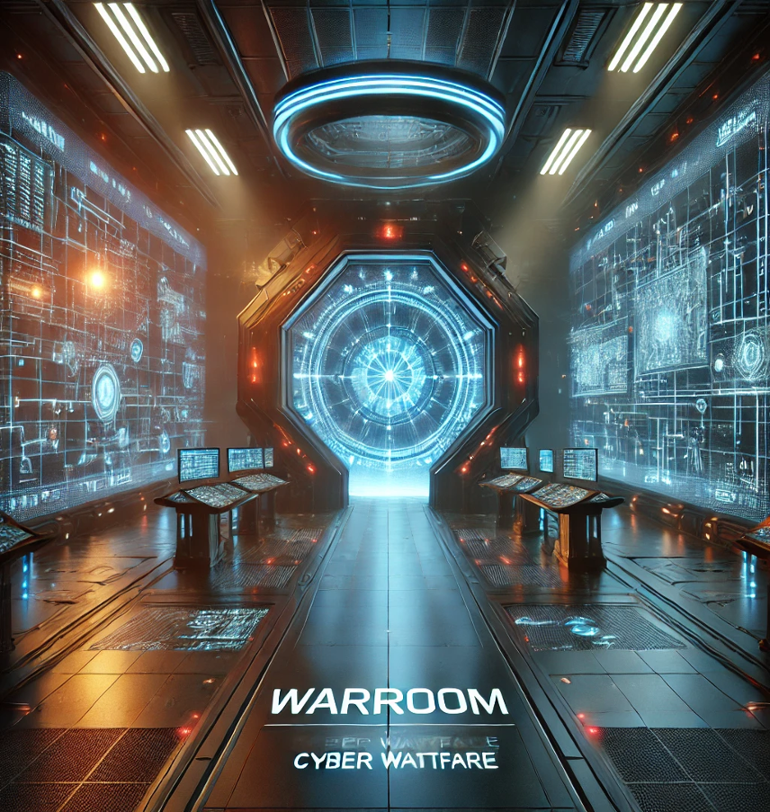

# Inventory

**Before we start, we need to take a look at our inventory.**

Thanks to the brave freedom fighters who gave their lives we have intel about the enemy’s equipment. 
- `Kali Linux`
- `Sliver`
- `Bloodhound`
- `Nmap`
- `Powershell`
- …

The Cyber hell environment is hosted on our `Nutanix` server. 
Workloads are deployed and provisioned using `Nutanix Prism Central CALM`.

# Important Intel

**General**
- Lab Access via the [Warroom Portal](https://warroom.cyberhell.be/): `warroom.cyberhell.be`
- [Lab Guide](http://192.168.253.134:3000/) **is only reachable from the Virtual Machines accessible via the Warroom Portal**. 

**Attacker**
- Use **Firefox** as web-browser in your **Kali Linux**
- Target domain: `nmbs.exn.be`
- Initial third-party supplier domain: `cyberhell.be`
- [Resource Server](http://resources.cyberhell.be): `resources.cyberhell.be`

**Defender**
- Use **your own web-browser** when **connecting to SaaS Security consoles** such as SentinelOne and Cortex XDR.

 

---

 

Congratulations! You're about to embark on an unforgettable adventure. 
Attackers, defenders — gear up and get ready for action!

