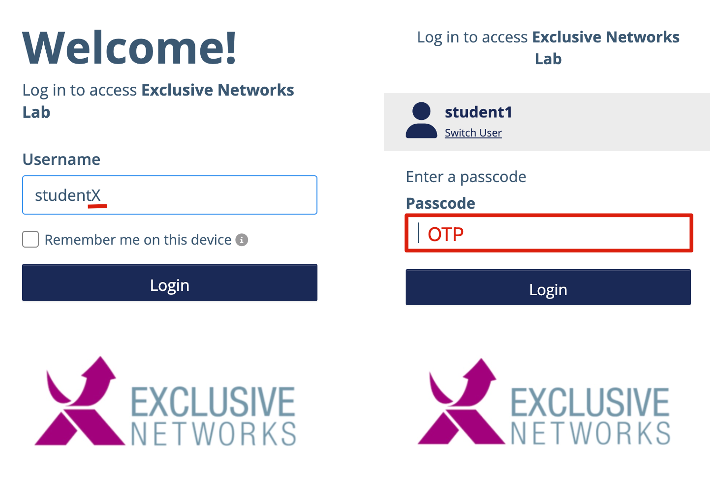
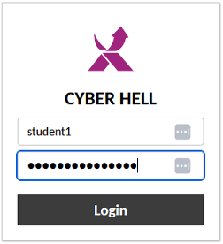
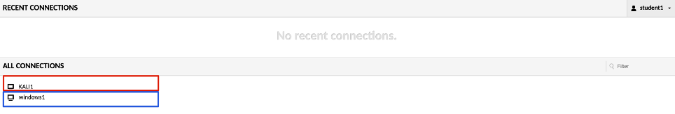

# Entering the Warroom

Fire up your browser and head to: 
[Cyberhell Warroom portal](https://warroom.cyberhell.be/)

To access the Warroom you must authenticate against our *Identity Provider (IdP)* **Thales SafeNet Trusted Access (STA)**.

1. Login with your Cyberhell credentials, formatted as `studentX`  (where `X` is your student number). Example: `student99`.

    - **USERNAME**: `studentX`
    - **PASSCODE**: Use the **Thales Hardware Token** to generate an **One Time Password (OTP)**

    

    *Once logged in, you’ll be redirected to the Warroom Portal (Guacamole), where you can access the virtual machines.*

1. Access the virtual machines using Guacamole aka [Cyberhell Warroom portal](https://warroom.cyberhell.be/)

    Log in to the Warroom portal (Guacamole) with your battle credentials, formatted as `studentX`.

    - **USERNAME**: `studentX`
    - **PASSWORD**: `Cyberhell2025$!`

    

3. Once connected to Warroom portal (Guacamole), under “All Connections” you should have 2 VM’s listed:

    - **Attacker Kali**: This machine will be your weapon as the attacker. 
    All offensive operations will be launched from here. 

    - **Defender Windows**: This machine will be your stronghold as the defender.
    Your mission is to fortify, monitor, and repel any incoming attacks. 

Note: If you're doing the workshop solo or using a single computer for both attacker and defender roles, you can easily switch between the Kali Linux and Windows hosts by clicking the window in the bottom-right corner.

---

**The battlefield is set, Helldiver.**
Step into the warroom, stay vigilant, and prepare to engage the enemy head-on.

To **COPY & PASTE** between your computer and the VM’s, use the Guacamole menu.

To open the Guacamole menu:
- On **Windows**, press `Ctrl+Alt+Shift` simultaneously
- On **MacOS**, press `Ctrl+Command+Shift`  simultaneously

 

