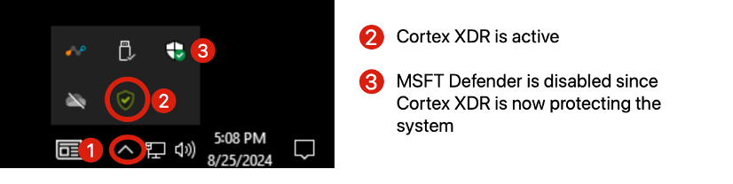
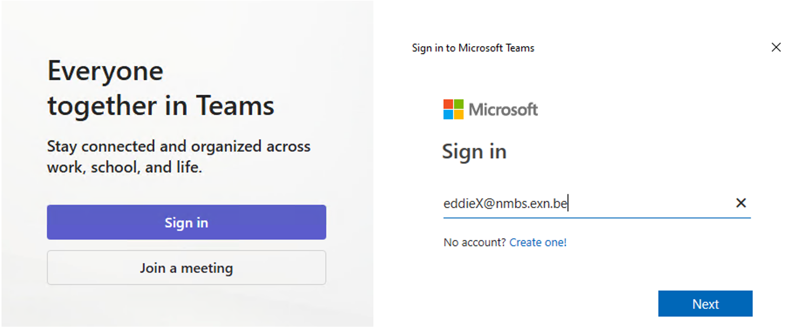

# Defender, Verify the Environment

**Defender**, connect to **Windows`X`** and verify that the security tools are installed and configured. 

Note: By starting a RDP connection with your `WindowsX` machine, you should be automatically logged in as `EddieX`.

 

## Prerequisites 

1. Verify Cortex XDR is installed on Eddie’s machine.

    

1. Open **Microsoft Teams** and login as `EddieX`

    - `eddieX@nmbs.exn.be` (where `X` is your student number)
    - Eddie's password is the **Cyberhell password**: `Cyberhell2025$!`

    

If you have issues entering the `@` symbol, please try `CTRL + ALT + @` otherwise use the Guacamole COPY PASTE menu.

