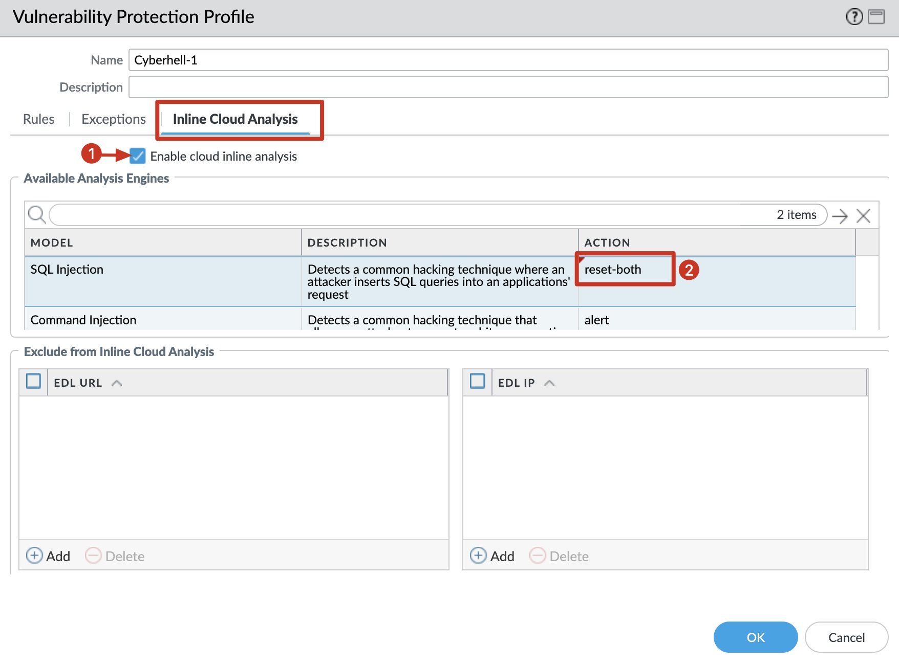
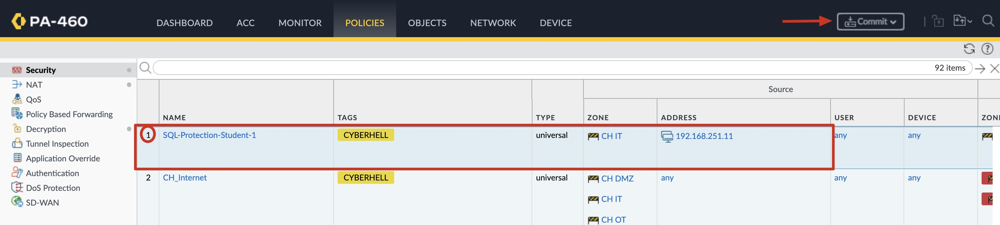

# Palo Alto NGFW

 The enemy is relentless, sneaky, and armed with malicious SQL payloads aimed straight at our web server. 
 
 Your mission? Leverage the Palo Alto Networks Next-Gen Firewall (NGFW) and shut them down before they even get close.

Advanced Threat Protection - ATP
Inline Cloud Analysis now supports detection of command injection and SQL injection vulnerabilities in real-time to protect users against zero-day threats.

[Click, here for more information about PANW ATP](https://docs.paloaltonetworks.com/advanced-threat-prevention/)

 

Use a **Vulnerability Protection Profile** in a **Security Policy** to protect the Web Server from any type of SQLi exploits.

### Vulnerability Protection Profile

 

### Security Policy

 

### Threat Logs

`Monitor` > `Logs` > `Threat`
- `HTTP SQL Injection Attempt`
- `DoctorAppointmentSystem SQL Injection Vulnerability`

