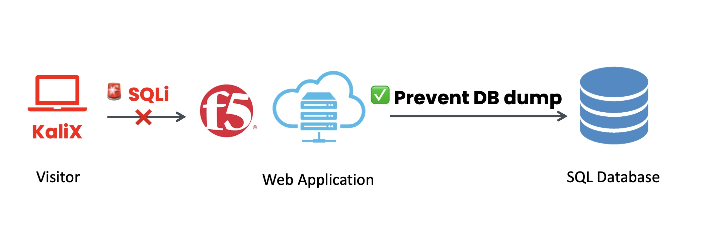
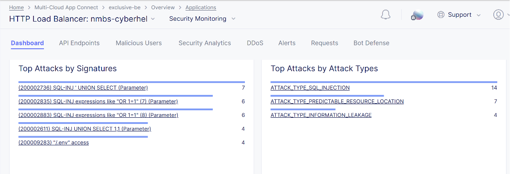

# Defender, it's time to reflect

**What crucial lessons can we extract from this devastating attack?**

Identify three critical mistakes made by the weak developer that opened the gates of Cyberhell:

- **Lack of Input Validation**: 
Implement robust input validation and sanitization (parameterized queries or prepared statements).

- **Inadequate Error Handling**: Don’t show detailed error messages, hackers can use that information to learn how your system works and find ways to break in.

- **Failure to Implement Least Privilege**: Restricting database access to only what was essential for the application's functionality.

 

# Learn from these mistakes

Fortify your defenses and ensure this breach never happens again.
Training and awareness alone won’t fix every weakness, and some will slip through the cracks. 

That’s why we need to take an extra step: By deploying a **Web Application Firewall (WAF)**, we can ensure that these types of web attacks are blocked before they even reach our applications and database services.

 

# Block SQLi using F5 WAF

Using the **F5 Distributed Cloud Platform** we can easily enable WAF capabilities in order to **block the SQL Injection exploit and prevent the DataBase dump**.

