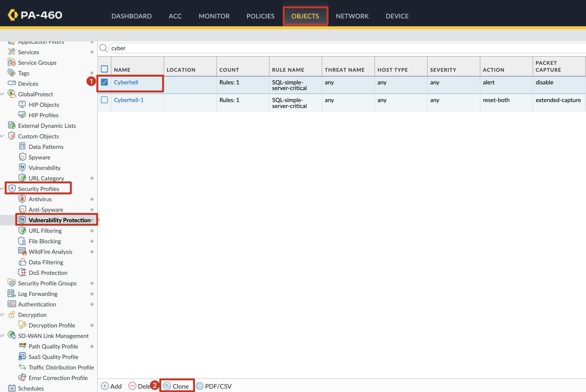
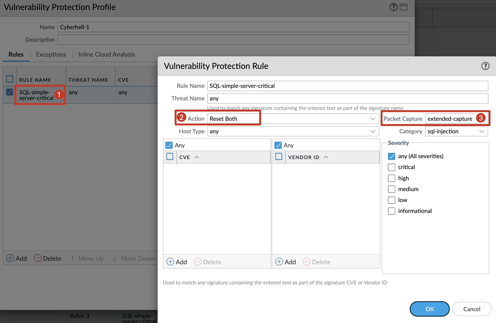
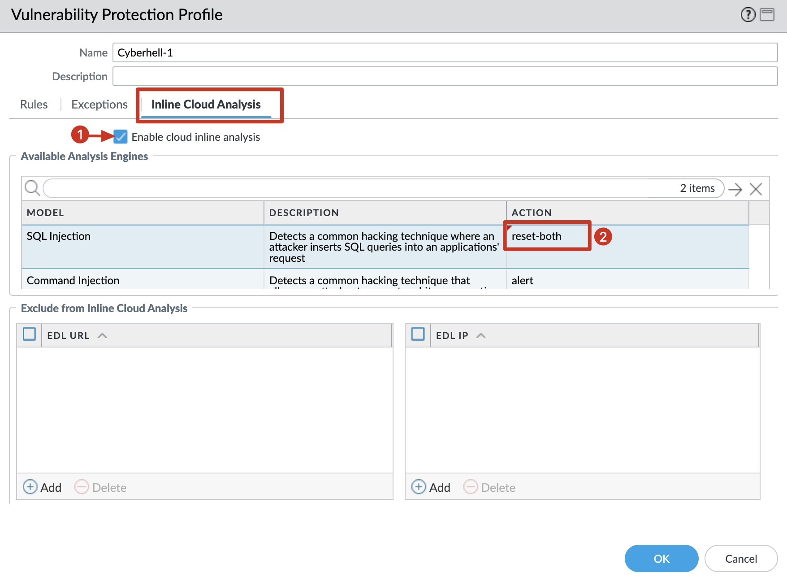
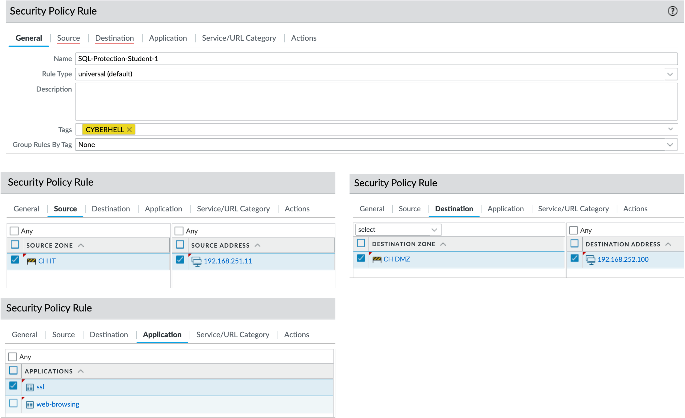
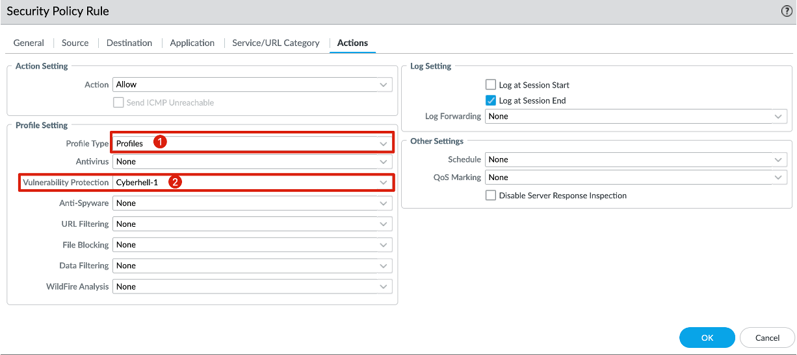
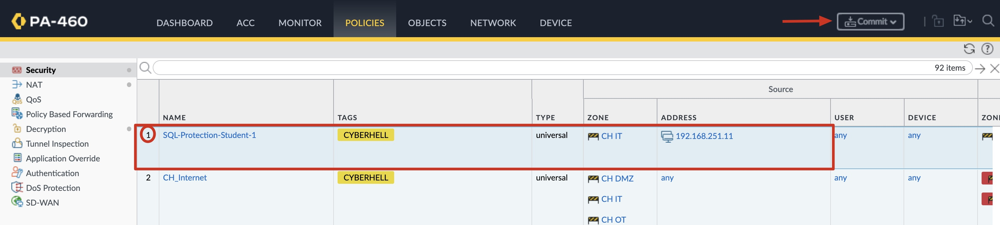
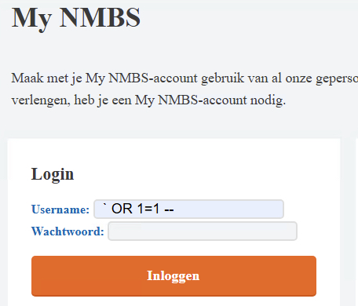
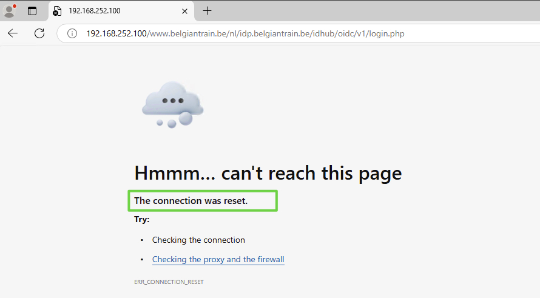
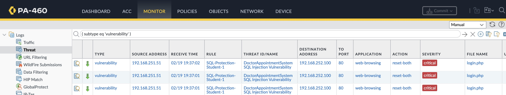

# Palo Alto NGFW

Alright, Defender, it’s time to put on your cyber armor and hold the line. The enemy is relentless, sneaky, and armed with malicious SQL payloads aimed straight at our  Database service through the web application.

**Your mission?** Leverage the Palo Alto Networks Next-Gen Firewall (NGFW) and shut them down before they even get close.

- Set up App-ID to identify and control application traffic.
- Deploy Threat Prevention profiles to detect and block SQL injection patterns.
- Use WildFire inline machine learning to stop zero-day SQL exploits before they execute.
- Log everything—because evidence is power, and we’ll need it to track down our attackers.

Advanced Threat Protection - ATP
Inline Cloud Analysis now supports detection of command injection and SQL injection vulnerabilities in real-time to protect users against zero-day threats.

[Click, here for more information about PANW ATP](https://docs.paloaltonetworks.com/advanced-threat-prevention/)

----

# Defense Activity

Create a Vulnerability Protection Profile in order to stop any type of SQL Injection attacks. Use the Vulnerability Protection Profile in a Security Policy to protect the Web Server.

The Web Server is located in the `CH_DMZ` Zone.
Web Server IP address: `192.168.252.100`.

## Access the Palo Alto NGFW

- IP address: `192.168.253.254`
- Administrator credentials: username `cyberhell` | password `Cyberhell2025$!`

## Vulnerability Protection Profile
- Open the `Cyberhell` Profile and review the `Rules` and `Inline Cloud Analysis` configuration
- Clone the `Cyberhell` Profile

- Edit the the Profile: change the name to`Cyberhell-X` where `X` is your Student-Number
    - Vulnerability Protection Profile Rule: `SQL-simple-server-critical`
        - action: `reset-both`
        - packet-capture: `extended-capture`
        

    - Enable `Cloud Inline Analysis` and set the action for SQL Injection to `reset-both`
    

## Security Policy

- Add a security policy: name `SQL-Protection-Student-X` where `X` is your Student-Number
- Source Zone: `CH_IT` 
- Source IP Address: `192.168.251.X0` where `X` is your Student-Number
- Destination Zone: `CH_DMZ` 
- Destination IP address: `192.168.252.100`
- App ID: `web-browsing` and `ssl`
- Service/URL Category: keep the default settings, `application-default`

- Actions > Profile Setting > Vulnerability Profile: `Cyberhell-X` where `X` is your Student-Number

- Save the policy and verify the policy is added to the `top` of the security policy stack.

- Commit the configuration

----

## Test defenses

Attacker, execute the SQL injection attack.

Notice, the connection is reset:

---

## Monitor

Defender, check the logs

- Go to the `Monitor` tab
- `Logs` > `Threat`
    - `HTTP SQL Injection Attempt`
    - `DoctorAppointmentSystem SQL Injection Vulnerability`

