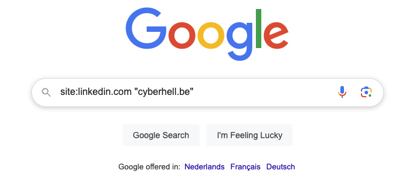
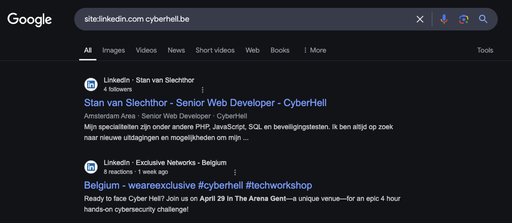
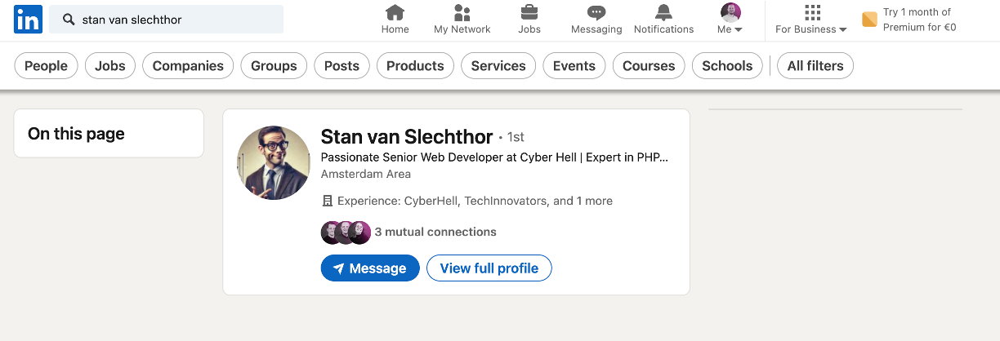

# We Got You...  

1. Open your web-browser and navigate to `google.com`

1. Use `Google Dorking` in order to rapidly find your target

    Type the following in your `Google Search`
    ```
    site:linkedin.com cyberhell.be
    ```


    

1. Analyze the results and compare them with the database dump

    

    <div class="purple">

    By now, you should have found our good friend `Stan van Slechthor`.    
    **Stan is a developer working for a company called Cyberhell.**
    </div>
    


1. Analyze Stan's LinkedIn page

    

    Stan is involved in the **NMBS** website project. Although he works for *Cyberhell*, he has an ongoing project for **NMBS**, meaning he is in close contact with the **NMBS team**.

    <div class="purple">

    **Congrats soldier**, you have made well use of your skills and have found your target – the developer - and his leaked credentials.

    I bet you can try them out on some typical business cloud applications...
    </div>

<br>


