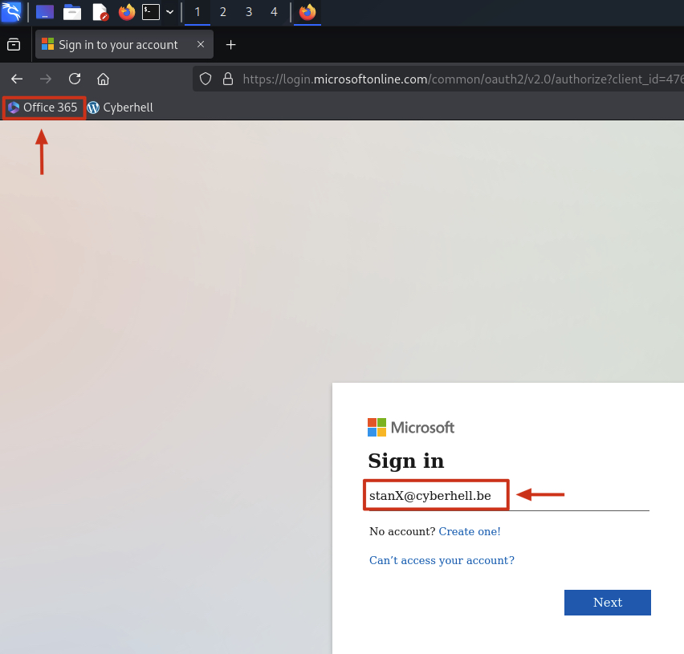
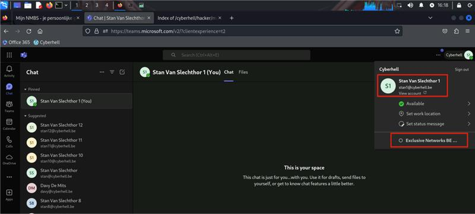
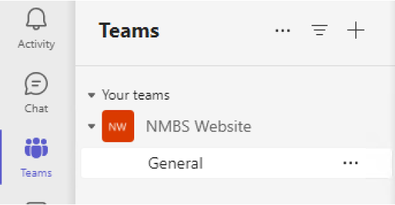
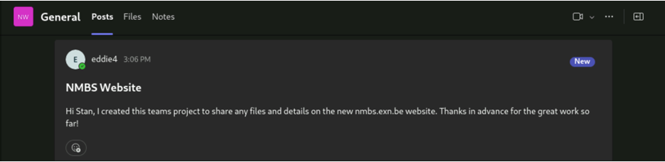

# Spearphishing - ATTACKER

Remark: Make sure you grab the right credentials, so you don’t sabotage your fellow soldiers. 

 

1.	**Attacker**, connect to your Kali Linux machine and open Firefox.

1.	Login to `teams.microsoft.com` using the weak developer credentials:
    - `StanX@cyberhell.be`, with `X` your student number.
    - The credentials you have found in previous SQL DB dump. 

    

    When asked `Action Required` for Microsoft Authenticator, click `Ask Later`.
    

    

1. Now we’re in **MSFT Teams** `Cyberhell` account connected as `StanX`, we  might have access to interesting documents, emails, contacts, … to go through, or to reach out. 

    Check where you have access to, who you can talk to, what other tenants you might be a guest… 

    

    Tip: looks like there are interesting guest tenant you have access to: `Exclusive Networks BE Lab`.
    

     

1. Switch to the **MSFT Teams guest tenant** by clicking on the top right corner on the initial of `StanX` name, and select `Exclusive Networks BE …`

    

    

    Note: We’re hosting our NMBSEXN environment in our Exclusive Networks BE Lab tenant, this is why you see this name as tenant where `StanX` is a **guest**. He is however limited to the NMBSEXN environment.
    

     

1. Look through the teams `StanX` is a guest off for anything interesting to work with. 

    

    Tip: There seems to be a shared team project called “NMBS Website” Stan has access to.
    

     

    

    Our contact is `EddieX`, who appears to be the owner of NMBS Website, and IT admin of the NMBS environment. This could be an interesting target.

    

    But how do we target him?

    Since we have a team which Stan`X` is member of together with `EddieX`, we can **leverage this trusted communication channel to send malicious files** to `EddieX`. After all, all communication on this Team project and channel is considered trusted.

    In attacker land, this is called **internal spearphishing**. We abuse the trust between `StanX` and `EddieX` as adversary to trick `EddieX` in opening files on his machine send to him by `StanX` via trusted teams, or so it seems.
    
     

6. Use Microsoft Teams to send that malware to EddieX. 

    

    Remark: we have no onedrive license, so you cannot share files directly with `EddieX`, but you might be able to drop them in the Files of the shared teams project.
    

    
     

    On your Kali, in the cyberhell folder under your home directory `~/kali/cyberhell`, you will find a file called `not_so_shady.wsf`, containing some harmless **VBScript code** that you would like your target to execute.

     
    

    (!) Bonus point for a creativity in the phishing lure.
    

     

   

