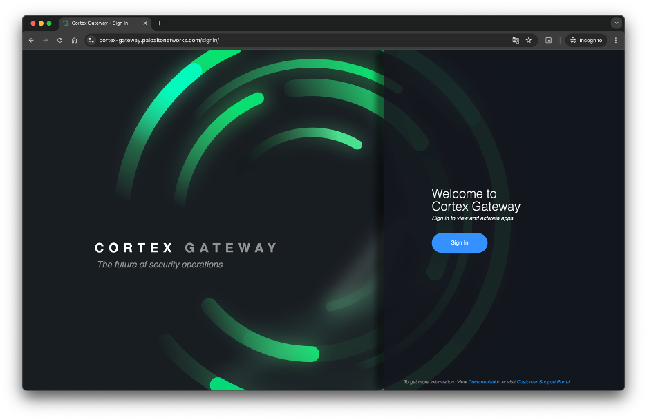
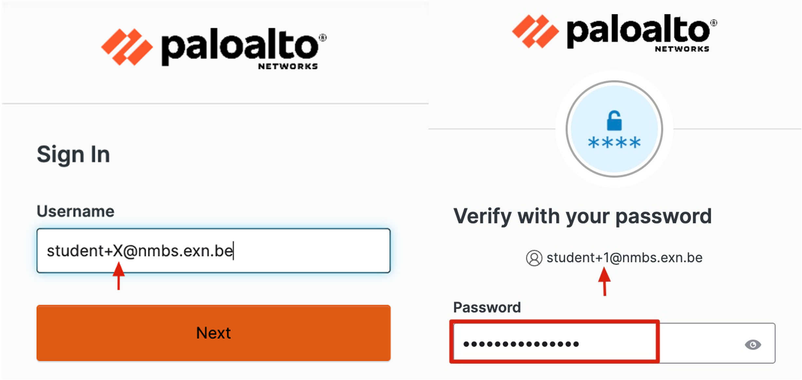
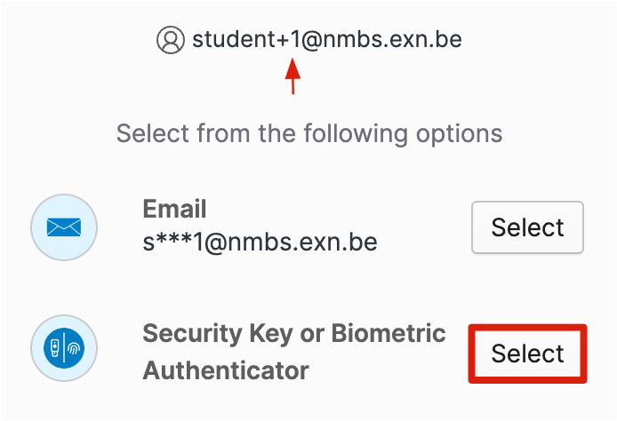
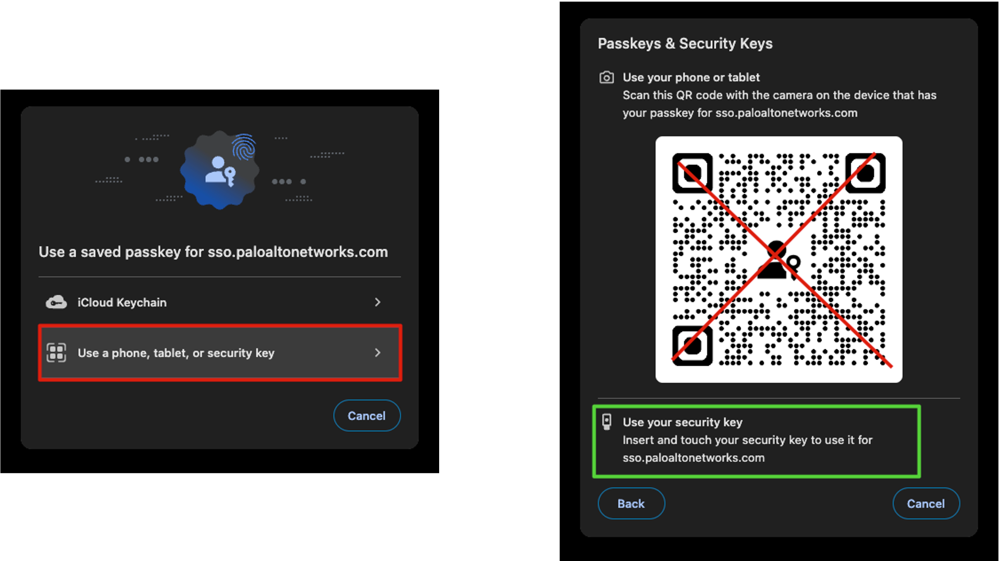
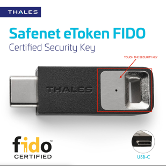
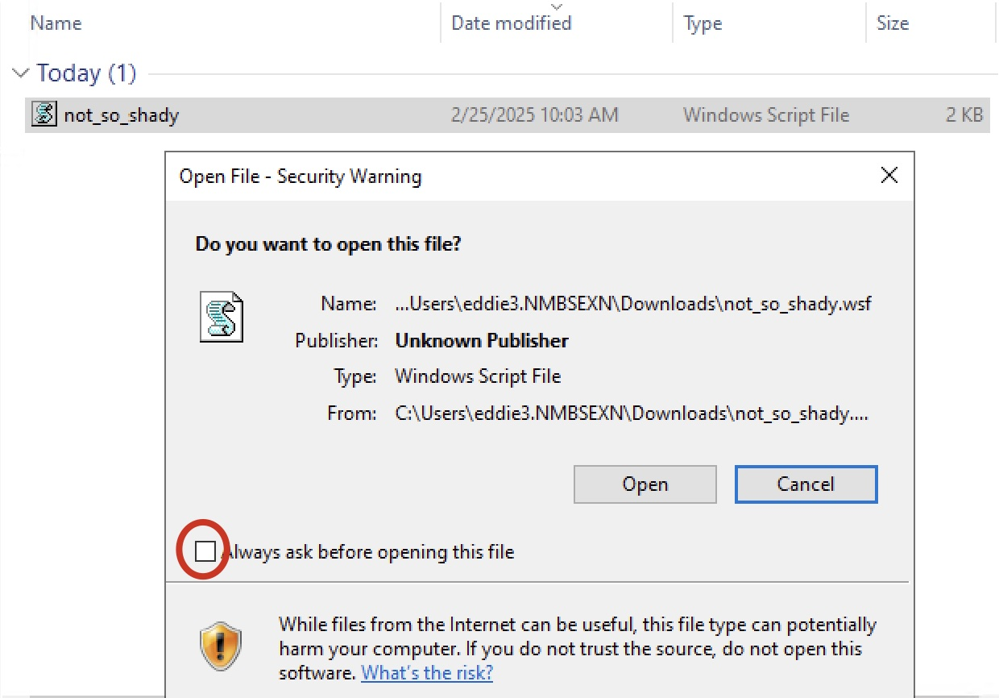
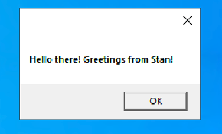

# Spearphishing - DEFENDER

**Defender** Congrats, you are promoted to Senior SOC Analyst.
Connect to the Cortex XDR platform to monitor security activities in real time.

Continue monitoring the platform throughout the workshop to maintain real-time visibility into malicious activity.

 

To log in to the platform, you will need a FIDO2 security key.

 

To access the Cortex XDR Platform, **you must use the browser on your personal device.** The Virtual Machines within the Cyberhell environment cannot be used, as access requires a FIDO2 Security Key that must be physically connected.

 

### Access the Cortex XDR platform

1. **Login** via the [Cortex-Gateway](https://cyberhell2025.xdr.eu.paloaltonetworks.com/)

    **https://cyberhell2025.xdr.eu.paloaltonetworks.com/**

    

1. Click on `Sign in`

    Username: `student+X@nmbs.exn.be` (Where `X` is your student)
    Password is the Cyberhell password.

    

    Make sure to add the `+` symbol, followed by your student-number.
    

     

    
 
    
    When prompted for **MFA** click `Security Key`.
    

    
    

1. You should be prompted to use a Passkey.   **Please ignore that and click on `Use phone, tablet, or security key`**
    
    

    

    DO <b>NOT</b> SCAN THE QR CODE ! Instead, use the FIDO Security Key
    

     

1. Insert the **FIDO2 Security Key** in your computer

    

1. **Touch** the FIDO2 Security Key to authenticate.

 

---

 

**Defender**, as a sysadmin you are working hard and using teams for communication about downtime. Against your better nature you open the file coming in via teams, because after all it comes from a fellow freedom fighter.  

1. Navigate to teams as `EddieX` on your Windows 10 Desktop machine. Inside the teams project you will find the file `“not_so_shady.wsf”` shared to you by `StanX`. 

1. Download and open the file.

    Click the tree dots to Download the file from Teams.

    Open the file on your machine:

     
    

    **Uncheck** the `Always ask before opening this file` before opening the file
    

     

    

    If it works out, and you can get the file executed by `EddieX`, he will see this on his screen:

    
