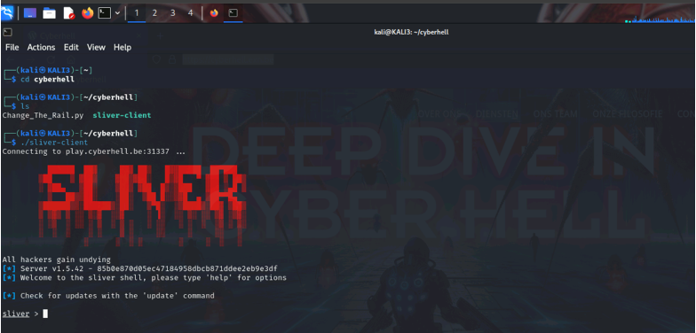
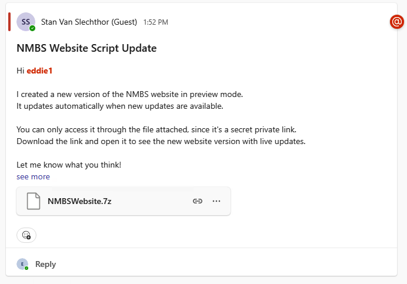

# Massively distribute C2 implant

### C2 Implant

The goal is to take control of the desktop machine `EddieX` is working on and get our initial foothold in the `NMBSEXN` domain.

The real malware we will deliver is a stage one payload which will download a **Sliver C2 implant**. 

<div class="info">
Sliver is an open source Command & Control framework actively used by adversaries. The C2 beacon will give you an active C2 communication channel on your kali directly into the host of Eddie. 
</div>

Before we drop the malware, as an attacker we must **start the Sliver Server and connect to it with a sliver client**.

<div class="purple">

Note: We did some work for you and already spun up a sliver server which all of you can connect to using the sliver client on kali. The sliver client is available on your kali under your home directory `~kali/cyberhell/`
</div>
<br>

1. Open a terminal on your Kali VM, go to the `cyberhell` folder containing the `sliver-client`. 
    ```
    cd cyberhell
    ```
1. Start the **Sliver Client**
    ```
    ./sliver-client
    ```
    

---


### Spearphishing via Teams

Even though you are using an outsource puppets account, damage can be done if not being careful with some real malware.  We have a deal with the North Koreans who provided us with an excellent zero-day malware. 

To keep control over what we’re doing, Cyberhell instructors will drop the malware to your `EddieX`teams project using an in-house developed extended version of community project: `TeamPhisher v1.3.`

`TeamPhisher` tool allows targeting multiple targets using teams, but in this case the tool is specifically modified to perform spearphishing via a shared teams channel as a guest.

---

When instructors are done, your `EddieX` will have received a new post in the NMBS Website teams. 

The post comes from Stan, has some instructions and this time comes with some real malware, packaged in a file called `“NMBSWebsite.7z”`.

The post would look something like this:
