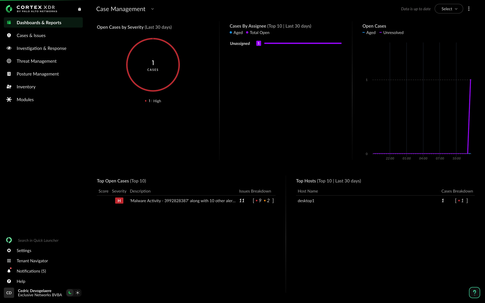

# Spearphishing - C2 implant

1. **Defender**, as a sysadmin you are working hard and using teams for communication about downtime. Against your better nature you open the file coming in via teams, because after all it comes from a fellow freedom fighter.  

1. Navigate to teams as `EddieX` on your Windows 10 Desktop machine. Inside the teams project you will find the file `NMBSWebsite.7z` shared to you by `StanX`. 

1. Download the file to your machine and extract it using 7zip (since it's a 7z file).

 

You wont be able to open the file directly from Teams downloads pop-up. Instead, go to the download folder and extract the 7z file from there.

 

1. Looks like Stan has send you a private link to the new NMBS website. Go ahead and open it.

  

---

 

Go back to **Cortex XDR**. 
**Refresh the page** and **look for new Events & Alerts**.

