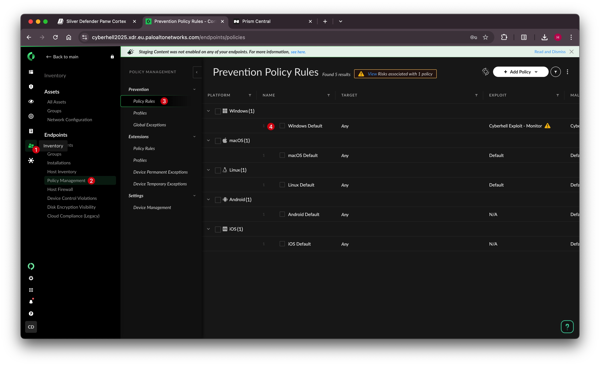

# Palo Alto Networks: Cortex XDR

### **Cortex XDR Mission**

Use the Cortex XDR platform to perform Incident and Response.

Try to understand what happened, how it happened, who and what has been targeted / compromised.   

Feel free to click through the Cortex XDR platform.
Systematically check the Cortex XDR platform to understand the advances of the attacker. Use the MITRE ATT&CK mapping available in Cortex XDR.

Finaly, create a mitigate and respond plan based on the information gathered about the attack.
Valuable information such as: `Asset, User, Network, and Cortex XDR agent data`

Cortex XDR is configured in Monitoring/Reporting mode. If you want to check the <b>“Prevention Policy Rules”</b>, have look at <b>Endpoint>  Policy Management</b>.

 

 

