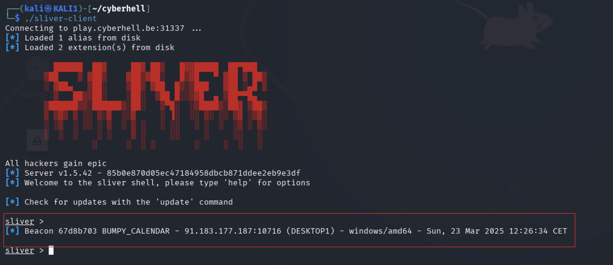
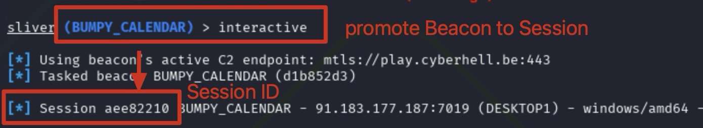
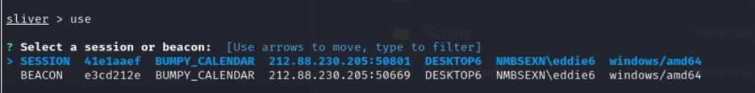
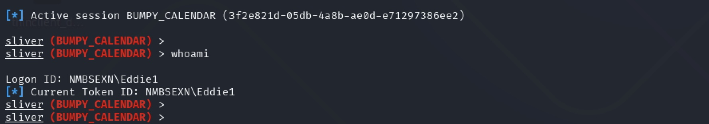
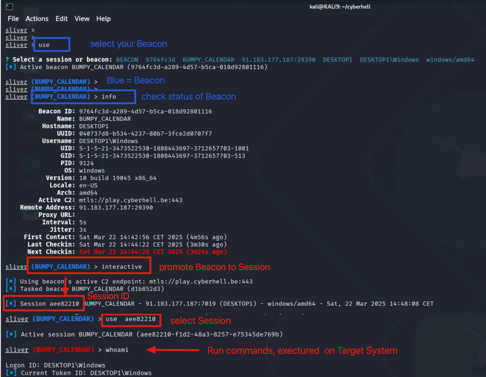

# Command and Control (C2)

Your objective:
- Promote your `Beacon` to a `Session` to run interactive command on your Target System.
- Use your `Session` to identify the current user on the Targeted System.

<br>

---

<br>


1. **Attacker**, check your sliver-client on your KALI`X`
    <div class="purple">

    Notice, a new beacon has appeared from `DESKTOPX` belonging to `EddieX`.
    </div>

    
    
    <br>
    <div class="red">

    Always use your assigned `EDDIEX` and `DESKTOPX` based on your `STUDENT-NUMBER`, `X`, to avoid interfering with your colleagues!
    </div>
    <br>

1. Enter:

    ```
    use
    ```

    Now select the beacon that corresponds to your target `DESKTOPX`, `NMBSEXN\eddieX`.

    <div class="info">

    Since you’re sharing the Sliver server with your fellow attacker warriors, things can get a bit messy in the list of beacons and later also sessions. 
    </div>
    <br>

    <div class="purple">

    Good tip: you can filter the list of beacons by typing `EddieX` with `X` your STUDENT-NUMBER. This will filter the list for your beacons only.
    </div>
    <br>

1. Enter:

    ```
    info
    ```

    This will show you details of the beacon and the host its running on. Validate you are attacking the right `EddieX`.

1. For ease of use, we will elevate this beacon to an interactive session. Make sure to elevate to a session. 

    To do this run:
    ```
    interactive
    ```
    
1. **Wait for a new session to appear!**

    Notice, once the session is created, the session ID is displayed on your console.

    
    

1. Use the **Session** by running the `use` command followed by your `session-id`
    ```
    use <Session-ID>
    ```

1. Now select the session belonging to your target `EddieX`. 

    You can identity the session because the line starts with SESSION instead of `BEACON`.

    <br>
    <div class="purple">
    
    Remark: sessions are interactive long living connections responding in real-time and allow us to work more smoothly. Beacons are interval based and operate more under the radar, however slower, which in this lab would just slow us down.
    </div>
    <br>

    

    Using this session we can now obtain more info about our target, his device, etc. 

    For example, run the command 
    ```
    whoami
    ```

    

    


<br>


## Recap: Sliver Client Commands

```
use
<!-- Select your Beacon-->


interactive
<!-- Elevate your Beacon to a Session -->


use
<!-- Select your Session-->
```

