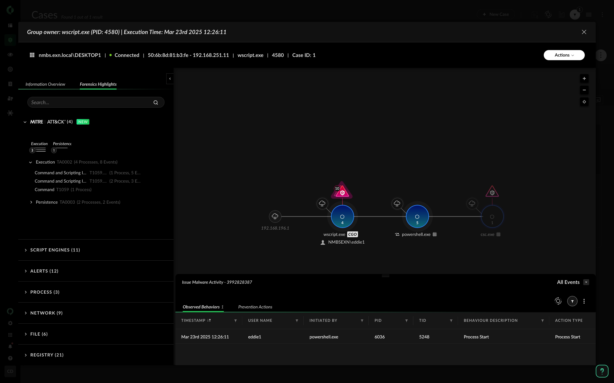

# Cortex XDR Step-By-Step Guide

**Defender** Congrats, you are promoted to Senior SOC Analyst.
Use the Cortex XDR platform to perform Incident and Response.

1. Go back to the [Cortex XDR Platform](https://cortex-gateway.paloaltonetworks.com/)

1. **Cortex XDR Dashboard**

    Start by looking at the Cortex XDR Dashboard.
    Go to **Dashboards & Reports**.

    **Note**: a new Case has been created.
    
    

1. **Cortex XDR Cases** (previously named "Incidents")

    Go to the `Cases & Issues > Cases`

    Add a **Filter** to only see the cases involving your user: `EddieX`

    - Filter: `Users = EddieX`

    

    Cortex XDR will detect the different stages of the attack and provide a list of involved assets, users, and artifacts.

    Take some time to explore and search for:

    - `MITRE ATT&CK mapping`
    - `Alerts`
    - `BIOC`
    - `Artifacts`
    - `Impacted Assets and Users`

    

1. Next, check out the `Key Assets & Artifacts`, `Alerts & Insight`, and `Execution` tabs for more detailed information about the attack.

    *Example: Resembling to PowershellBase64, Shellcode execution, Suspicious script engine activity, etc.*

    

    - Review the `Key Assets & Artifacts` tab
    - Review the `Alerts& Insight` tab
    - Review the `Execution` tab

1. Go to the Execution tab and expand the `Execution causality chain`, by clicking on `Expand`.

    *Notice that a new page should open, displaying a visual representation of the attack—also known as the causality chain.*

    In the top-left corner, you’ll find two tabs: `Information Overview` and `Forensics Highlights`. Click on each tab and review the information related to the attack.
    
    The Execution / Causality Chain is dynamic, meaning you can click on different stages of the attack to gather more details about specific events.

    
    > Active Script: `C:\Users\eddie1\Downloads\a_little_shady.wsf`

    

1. When expanding the `Causality Chain` under the `Execution` tab, navigate to the `Forensics Highlights` tab and look for the MITRE ATT&CK mapping.

    

     
    
    

    > C2 Server Domain name: `play2.cyberhell.be`

    
---

### Questions and Answers

1. How many `ARTIFACTS` does Cortex find about this incident?

    - `Cases > Overview > Artifacts`

    - `Cases > Key Assets & Artifacts > Artifacts`

    
    

1. What are the `ASSETS` for this incident 

    - `Cases > Overview > Assets`

    - `Cases > Key Assets & Artifacts > Assets`

    

1.  What is the NAME of the `ROOT PROCESS` used by the malware?
    
    - `Cases > Alerts & Insights`. Filter by Timestamp. Next, click on the Cortex XDR event, to get more details about the process(es) involved.
    Search for `Process Execution > Iniciator Details`

    - You can also use the **Causality chain**, available via the `Execution` tab: `Cases > Executions > Causalities > Expand`

    
    

1. What is the `C2 Server IP` address and Domain name?

    - `Cases > Executions > Causalities` > click on `Expand` > Open the `Forensics Highlights > Network`: look for `IPV4 addresses`.

    - `Cases > Executions > Causalities` > click on `Expand` > Open the `Forensics Highlights > Network`: look for `Domains`.

    

