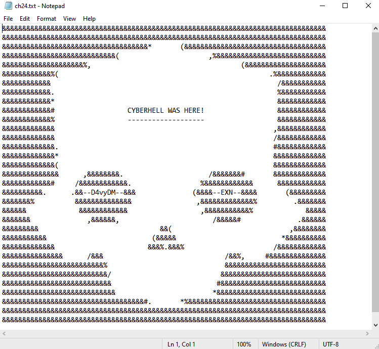

# Persistence

As an experienced attacker, you wrote your malware well. The original file downloaded and executed by Eddie disappeared instantly after he executed it.

This is all part of a persistence move in which the malware file is moved to a hidden location on disk, and persistency is added so after reboot, our c2 just comes back.

If you have time, go ahead attacker and test your persistency. Reboot Eddie’s DESKTOP machine using the command on your sliver terminal:

- Use your beacon to run remote command on `DESKTOPX`
    ```
    use
    ```
- Select your beacon `DESKTOPX`

- Leverage the sliver beacon to reboot `DESKTOPX`
    ```
    execute shutdown /f /r /t 0
    ```
Check with Eddie if his machine is rebooting. After it reboots, let him login to his machine, and you will see, your C2 beacon will come back.

Attackers are funny guys, they added a little easter egg for fun:




<br>
<div class="purple">

Remark: if you reboot the machine, a new beacon will dial in. Do not forget to convert it back to a session using previous instructions.
</div>
<br>

---
<br>

**Short recap of the commands:**
```
> beacons
> use 
> info 
> interactive
```

<br>
<div class="purple">

Remark: you can filter the beacons/sessions in the `use` command by typing `EddieX` with `X` your student number on the interactive shell. 
OR you can type: `use {ID}` and part of the ID of your beacon.
Watch the **“Next Check-In”** to find the most active latest beacon to interact with. A session is always connected so this only applies to beacons.
</div>
<br>