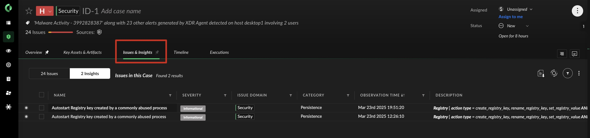
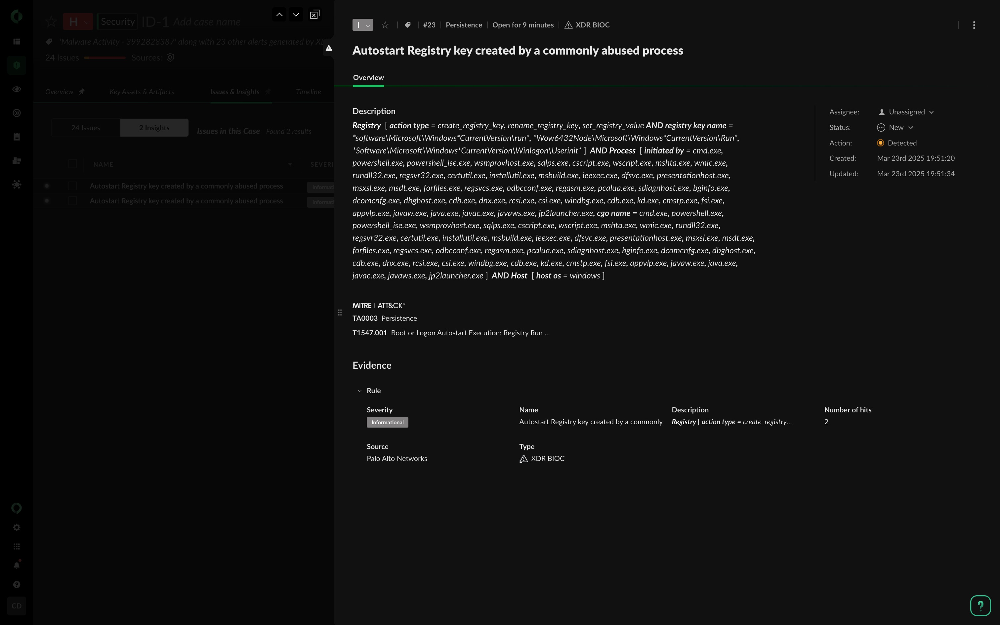
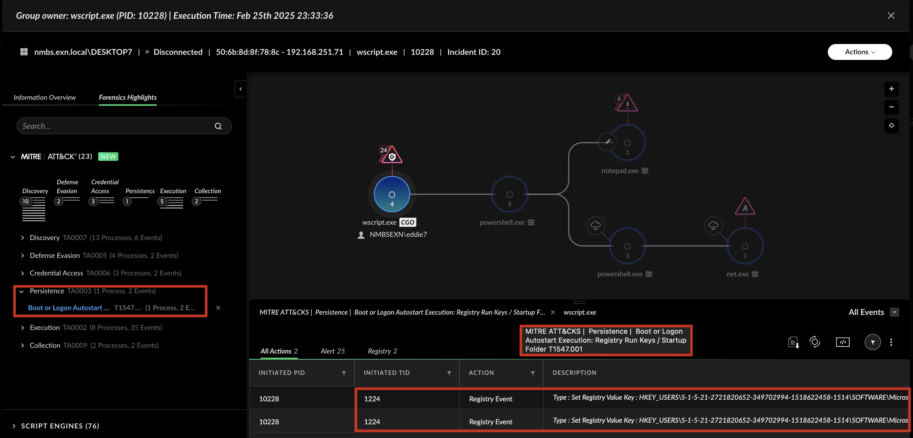

# Persistence

Defender, go back to the Cortex XDR platform and analyse what happend after DESKTOP`X` rebooted.

Hunt for more details about the persitent C2 malware.

1. Review **Alerts, Artifacts, Processes, Networks** etc.
1. Review the `Alerts & Insights`.
    

    

1. Check the **Forensics Highlights** and **MITRE ATT&CK** mapping. Pay attention to the **TTP**'s (`Tactique`, `Technique` and `Procedure`)

    
