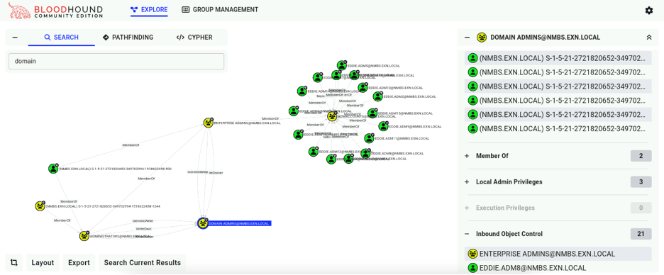

# Domain Discovery

## c2tc-domaininfo
In this task, you will **continue discovery by enumerating NMBSEXN domain info**. 

<div class="info">

`Sliver` contains a package manager called `armory` which stores add-ons that enable you to do a lot more than the built-in functionalities can offer. One of these add-ons will provide the start of the domain enumeration phase: `c2tc-domaininfo`.
</div>

<div class="purple">

We have already installed the `c2tc-domaininfo` package through armory.
The package is located in the `extensions` directory within your `Sliver Client` configuration directory.
</div>

1. Enumerate some basic domain info using `c2tc-domaininfo`


    In your Sliver Client, run the `c2tc-domaininfo` package.

    **Make sure to run it within a Session!**

    ```
    c2tc-domaininfo
    ```
    This will enumerate active directory domain info.

    

    <br>

<div class="purple">

Nice, we just found the domain is `nmbs.exn.local`, the `DC` is `CH24-DC01.nmbs.exn.local` and `192.168.253.10 `is its IP.
</div>

<br>


## Bloodhound & Sharphound

Now that we have info on the DC, let’s get more details about the domain by using the community edition of a tool called **Bloodhound**. 

Bloodhound is used to discover hidden objects and relationships in AD and is able to visualize this data in a very convenient way.


<div class="purple">

Remark: We have already deployed Bloodhound, it is hosted on a local server accessible for all students within the cyberhell environment. The data nevertheless should still be gathered!
</div>


<div class="info">

To collect Active Directory data for **BloodHound**, we use a tool called SharpHound. It scans the network and saves the results in `.json` files that BloodHound can analyze.

The good news? **SharpHound** is already available as a pre-packaged module through Sliver's **Armory**, and we’ve pre-downloaded it for you. That means you can run it directly from your Sliver session—no setup required.
</div>


## Sharphound

<div class="purple">

Remark: We have already installed the **Sharphound** package and should be accessible by your Sliver Client.
</div>


1. Using an active Session on your Sliver Client:

    - Create a new temp directory on the windows host under your control:

        ```
        mkdir "C:\temp"
        ```


    - Navigate to the temp directory:

        ```
        cd "C:\temp"
        ```

    - Run Sharphound to collect AD info using:
        ```
        sharp-hound-4 -- '-c All'
        ```

    <br>

    <div class="info">

    Sharphound enumerates the domain and will save the results in a `.zip` file on disk, in the current directory `C:\temp`

    Remark: performing a full sharphound discovery can take a few minutes. Ignore any errors about access to a certain path.
    </div>
        
    <br>

    Example output:

    


    

    <div class="purple">

    **Remark: we have already deployed a Bloodhound server and uploaded the BloodHound.zip file for you.** Since we’re all in the same domain this provides everybody with the same information.
    </div>
    <br>


## Bloodhound


1. Access the [Bloodhound server](http://bloodhound.cyberhell.be/) from your Kali

    URL: http://bloodhound.cyberhell.be/ (NO HTTPS)

    **Login to Bloodhound** as `studentX` and your Cyberhell password.

1. At first, your AD graph will be empty. Leverage the search bar to find some objects of interest which could grant you access to the controls of the railway system. Such objects, like user accounts or systems, are often grouped in containers, groups or OUs.


    - Remember your target, our goal is to **hack** into their **OT environment** and take control over the railway station, sabotage it, break it, etc.
    - Can you **find some info** which can be **related to the controller environment**? Try searching for “OT”, “train”, “controllers”, “RDP”, etc.
    
     

1. Look closely and you will find some interesting objects like:
     
     - **OT_USERS** organizational unit (OU) hosting the `RailwayControl` group. You can find this by clicking the `OT_USERS` icon and opening the Groups section in the details on your right.
     - Let’s drill down further on this `RailwayControl` user group. Open `Execution Privileges` > `RDP Privileges`. It seems to have RDP access to the DC and some server called `OT_Jumpstation`… Could this be a Windows Terminal Server??
     - It is very likely that this **terminal server** specifically set up for OT users could contain valuable information about the railway system. 
     Or it might even serve as a **jumpstation**. These often offer a pathway to air-gapped parts of the network.

     

     This `OT_Jumpstation` server offers good potential. Because we discovered that the “Railwaycontrol” user group can RDP to both the DC and this terminal server, the group can be of great interest. 


1.	So, **what do we try?**
    - Get credentials of one of the members of this group...?
    - Add our own account to this group...?
    - Try to exploit the jumpstation itself...?
    - …

    **Here’s the plan**. We want to be stealthy, and no way these guys are monitoring their AD (we hope). So, let’s try to get ourselves into that `RailwayControl` group without being spotted.
    
    For that to be able to happen, **we need some way of adding a new user to the group**. This can be done by **domain admins or enterprise admins**. 
    
    Let’s find out how to become a domain admin so we can create and add a new user to the `RailwayControl` group.
    

1. Search for the `Domain Admins` group:

    


1. Check the **members** by clicking on the `DOMAIN ADMINS` icon. As these accounts do not bring us much further, we can dive a little deeper by also opening the `Inbound Object Control`. 


    

    This reveals a lot more:
    - There are a lot of `Eddie.admX` users. Sounds like admins to me.
    - These users are member of a group called `ADMACCOUNTS`.
    - And that group is a member of… yes, `ENTERPRISE ADMINS`!
    


