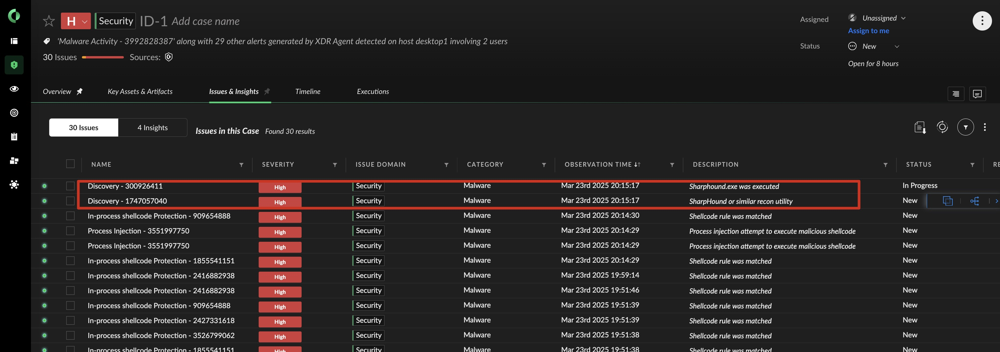
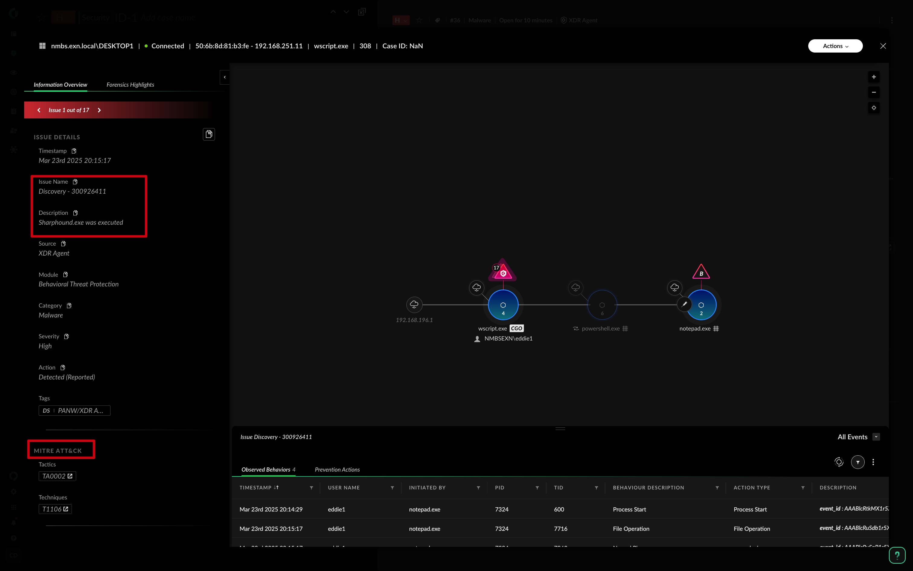
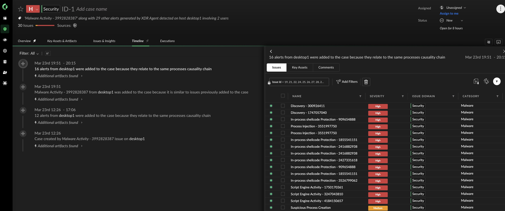

# Palo Alto Networks: Cortex XDR

### Defender, it's time to investigate!

Return to the [Cortex XDR Platform](https://cortex-gateway.paloaltonetworks.com/) and analyze the attacker's actions. 

**Your Mission: uncover evidence of Domain Discovery / Enumeration using Cortex XDR.**

🔍 Investigation Tips:
- Navigate to **Incident > Execution**.
- Utilize the **Causality Chain** and **Forensic Highlights** to trace the attacker's steps.
- Have a look at the **Alerts & Insight** to identify the tool(s) used for **Domain Discovery / Enumeration**.

 

### Domain Discovery detected

### Sharphound detected

### Attack Timeline

