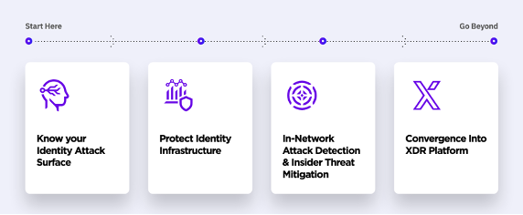
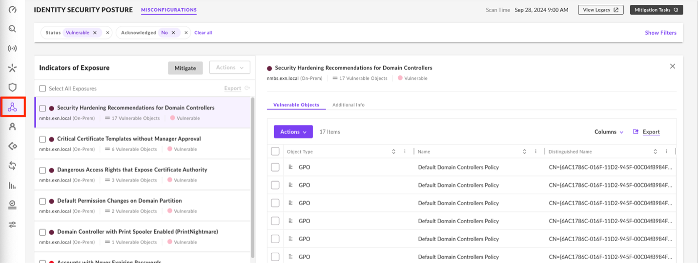
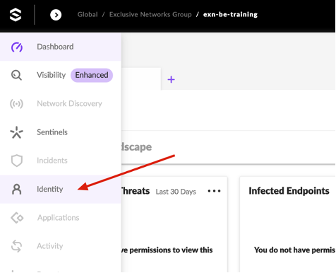
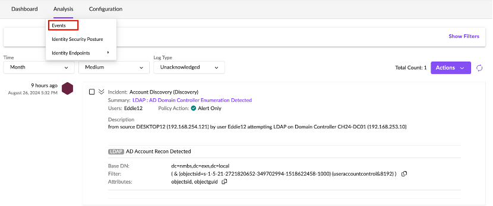
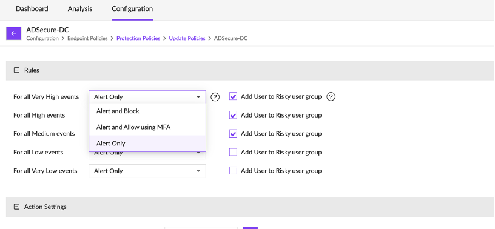
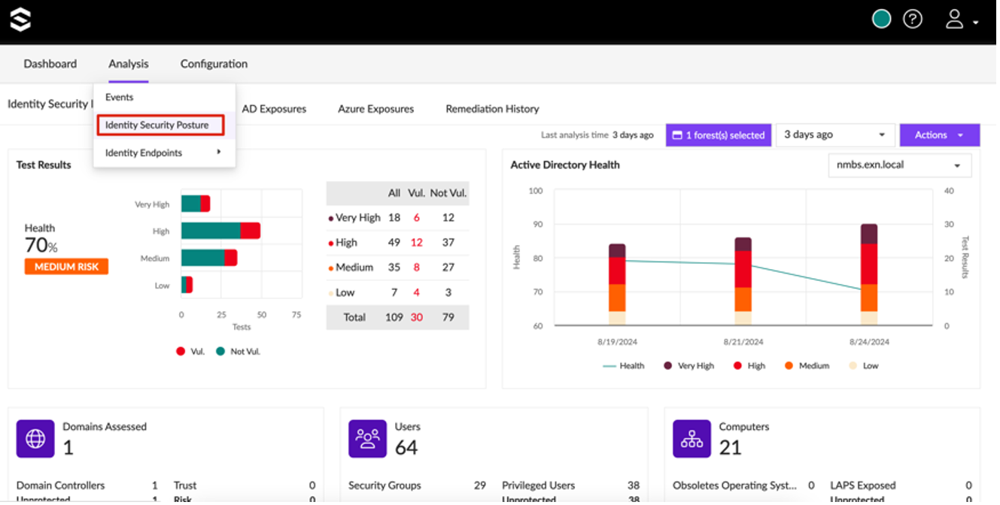

# SENTINELONE SINGULARITY IDENTITY

As you might have noticed, active directory holds the crown jewels. If someone is able to control this environment, they often have access to the complete network. This allows you to steal credentials, gain access to unauthorized systems, spread malware across the network, … That’s why Identity has been given more focus over time and keeps on gaining attention while designing a modern security architecture.
Through it's highly dynamic nature, often managed by multiple administrators, and being intertwined with all types of other systems, companies nowadays need specialized tools to protect these hard to maintain environments.

One of these is **SentinelOne Singularity Identity**, a tool specifically focused on **securing active directory**.

The suite consists out of **three** products:

1. **Identity Security posture Management (ISPM)** - checks AD and Azure AD configuration for misconfigurations and vulnerabilities
2. **Singularity Identity for IDPs** - prevents Kerberos attacks and AD Reconnaissance attacks in real-time
3. **Singularity Identity Detection & Response** - hides critical AD assets and inserts decoys in the AD responses; detect and prevent reconnaissance scans, lateral movement and credential exfiltration

We have configured ISPM and Singularity Identity for IDPs. **Let’s check whether SentinelOne has detected our AD enumeration.**

----

1. Log in on the [SentinelOne console](https://euce1-110-nfr.sentinelone.net/) using **SSO**

    URL: https://euce1-110-nfr.sentinelone.net/

    - Click on **Login with SSO**.
    - Enter your student email address: `studentx@nmbs.exn.be`
    - Login to Thales with your username: `studentX`
    - You will be **redirected** to **Thales SafeNet Trusted Access** where you can continue with `studentX` and the Cyberhell password followed by `MFA`.

    

    You will be logged in as a read-only Identity administrator. 
    

     

1. Let’s quickly start with exploring the ISPM page, showing Identity Security Posture Management on our domain. 

    This gives info on any **Indicators of Exposure** in the domain. *For example, accounts with never expiring passwords.*

    Take a quick look around.

    

1. Now navigate to the **Identity console** itself by clicking on the icon on the left of your window.

    

1. A new tab opens which brings you to the **Dashboard**. There you can already get a glimpse of the detected attacks and your security posture. Have a look and click around. See whether you can find the events which alert on `AD Domain Controller Enumeration`.

    

    In `Analysis > Events`, you can see all the detections done by the Identity agents installed on the DC. Notice our policy is configured in **Alert Only mode**. This can be changed in `Configuration > Identity Policies > Protection Policies > Update Policies > ADSecure-DC`. 

    

    

1. If you are ahead of schedule, have a look at the current **health score of our active directory** environment in `Analysis > Identity Security Posture`. 

    

    This module is similar to the ISPM module in the main console.
    

    The Dashboard shows our overall Health score for the domain. **Every 7 days** the **domain is scanned** for known **misconfigurations** and the system advises steps to remediate.

    

    Check the AD Exposures on misconfigurations in our domain. 

