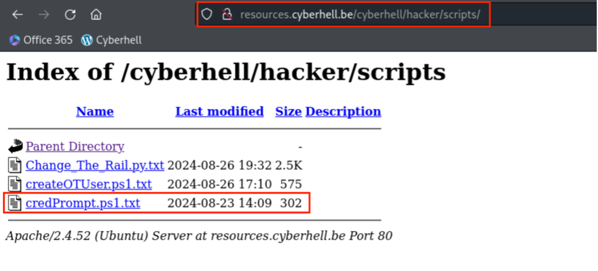
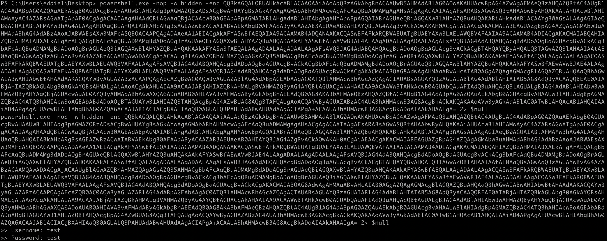

# PRIVILEGE ESCALATION - ATTACKER

On your Kali, go back to your Sliver Client.

<div class="purple">
If your session has expired, or if you don't know how to access your session: please ask help to an instructor.
</div>
<br>

1. Using an active **Sliver session**, open up a `shell`: 

    ```
    shell
    ```

1. Acknowledge you are an adult 😈


1. Go to the [Cyberhell Resources Server](http://resources.cyberhell.be/) 

    - Navigate to `/cyberhell/hacker/script`. 
    - Open the `credprompt.ps1.txt` script. 

        

        <div class="info">

        The script contains powershell code to prompt EddieX with a fake credential prompt for his Admin domain credentials. 
        The credentials `EddieX` enters will appear on the **console in your Sliver Client**.
        </div>

    - **COPY the content of the file and PASTE it in your Sliver Client shell**.

        <div class="red">

        Remark: Copy-paste in sliver can sometimes be a bit tricky, make sure the command is executed with an enter in the end (meaning the **cursor** should be on the next line).
        </div>

        
    
        Excellent, the script now awaits for the victim to fall for the trap.