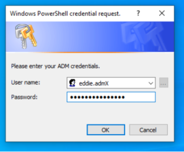

# PRIVILEGE ESCALATION - DEFENDER

**Eddie**! Go to your windows desktop.

**What’s this?**

A Windows Powershell credential prompt I need to enter my ADM account, probably some update or something. Let’s fill in your admin credentials.

If you don't see the popup, make sure to check if the windows is not hidden behind another application window.

 

Note: the credentials for `Eddie.admX` will be provided to you by the instructor.

