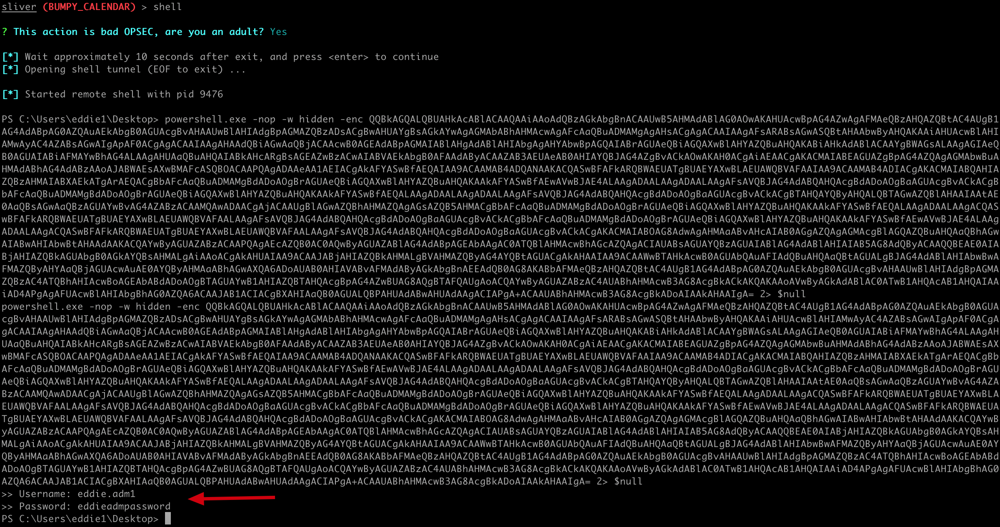
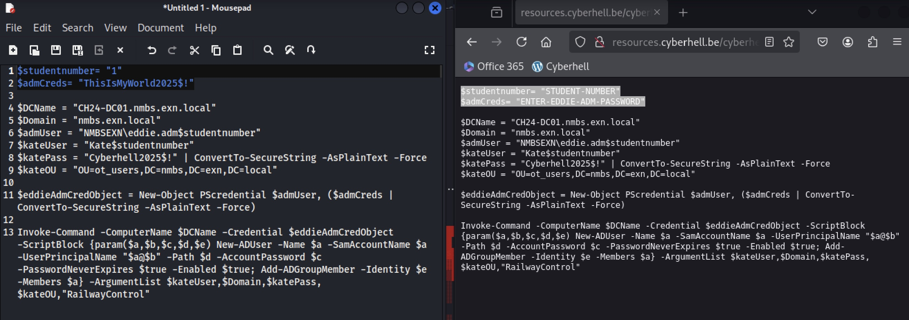
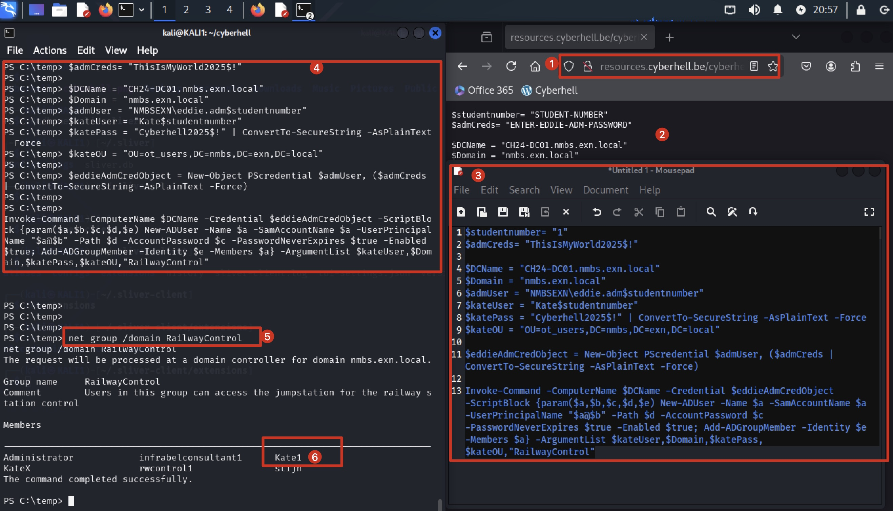

# PRIVILEGE ESCALATION - ATTACKER (ctd)

Perfect! Eddie fell for the trap and filled in his ADM credentials, we can see them plain text on the output of our sliver client.
<br>

1. Go back to Kali and check the output in your Sliver client.

    Look very carefully for an output something like this at the bottom of the screen:

    ```
    >> Username: eddie.admX
    >> Passowrd: [eddieadmpassword]
    ```

    


<br>
<br>

# LATERAL MOVEMENT - ATTACKER

Now it’s your time to shine soldier. We now have the credentials of an **Enterprise Admin** account in AD, we can use these credentials to connect remotely to the domain controller and **add a new user to the OT group** allowing us to login to the jumpstation.


1. Go to the [Cyberhell Resources Server](http://resources.cyberhell.be/cyberhell/hacker/scripts/)

    Script location: `/cyberhell/hacker/scripts`

1.	Open the `createOTUser_v2.ps1.txt` script and **COPY the content**.

    <div class="info">
    
    The script creates a new user called `KateX`, so modify the script with your student number and the credentials you just gathered, before executing the script.
    </div>
    <br>

1.	**PASTE** the content of the script in a **Text Editor** so you can easily modify it
    
    **Change** following in the **script**:

    - `<STUDENTNUMBER>` 
    
        Replace with your student number (**2 occurrences** in the file)
    - `<EDDIE.ADMX CREDENTIALS>` 
    
        Replace with the credentials Eddie enteres in previous step (**1 occurrence** in the file)


    <br>

    **Example: script for `Eddie.adm1` that creates `Kate1`.**

    


1. **COPY** the **modified script** and **PASTE** it within your Sliver Client **shell**


1. Now you can validate you effectively added `KateX` to the **RailwayControl** group using a simple net command on the shell prompt you have in your sliver client:


    ```
    net group /domain RailwayControl
    ```

    **Example output: script for `Eddie.adm1` that creates `Kate1`.**

    


    


