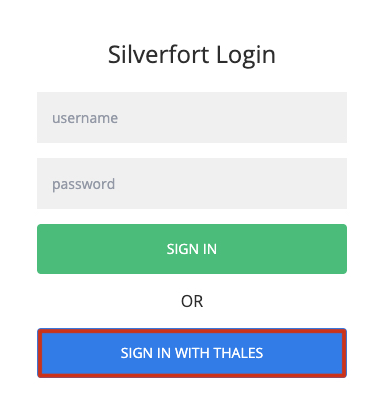
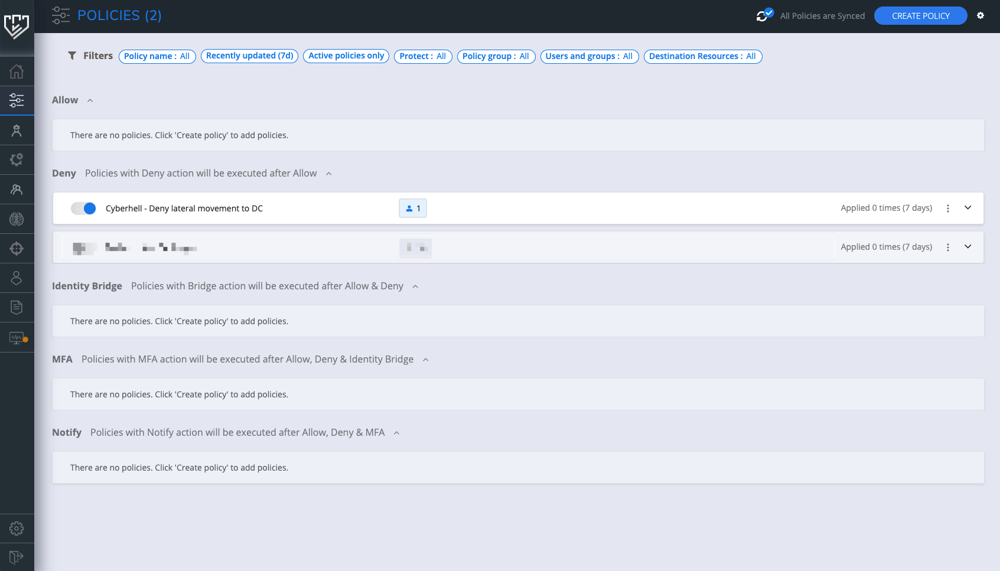
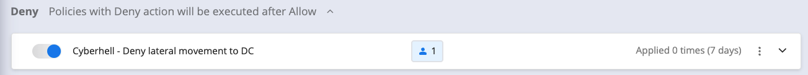
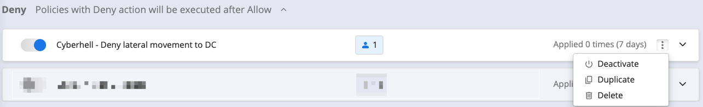
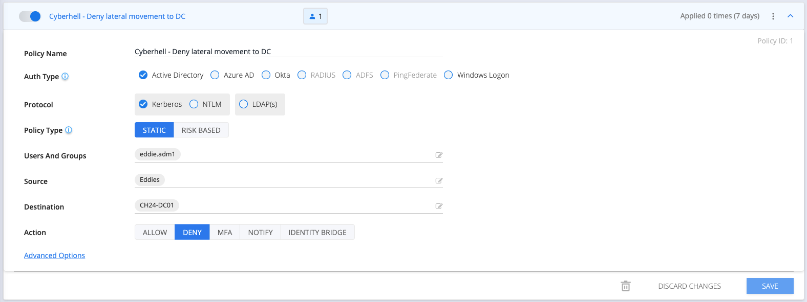
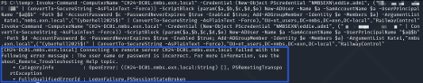
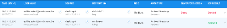
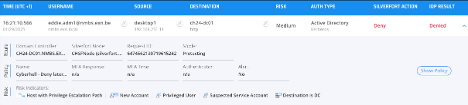

# Defender! How did the enemy get so far in our organization?

Team suit up , this is your moment of glory. Take it ! 

Use Silverfort to block remote powershell to AD from the compromised machine.

1.	Login to the [Silverfort admin console](https://silverfort.cyberhell.be) using Single Sign On.

    - Silverfort URL:  https://silverfort.cyberhell.be
    - Click on **Sign in with Thales**.

    

    

    Note: Your view is limited as student, but you have write capabilities on the policies tab.
    

     

    

    Remark: You have full rights on the policies, so please **DO NOT change policies unrelated to this course** and only adjust the policy for your EddieX account!
    

     

2.	In **policies**, you have different sections like Allow, Deny, MFA, etc. policies. We will be using the Deny policy to block lateral movement from the compromised DesktopX to the Domain Controller.

    
 

3.	Open up following policy under the “Deny” section:

    

    This is a **deny policy for lateral movement** from a specific **source** OU “Eddies” containing all the desktop machines you are working with and thus got compromised.

    The **destination** is the domain controller, and some specific **services** used in remote powershell, wmic, etc.

    In order to block the lateral movement from your DesktopX machine, find the policy `Cyberhell – Deny lateral movement to DC`.

4.	**Duplicate** the policy `Cyberhell – Deny lateral movement to DC`

    
 

5.	Give the policy a name including your Student number

6.	Open your own duplicate policy:

    

 

7.	Add your Eddie.admX user corresponding to your username to the ‘Users and Groups’ field. Make sure you add the **`eddie.admX` account**, and not eddieX, since the attacker is performing the remote powershell execution with eddie.admX account.

8.	**Save** the policy at the bottom right.

9.	Make sure to **enable** the policy

 

10.	Wait for the **policy sync** to end (top right of the screen):

    

 

---

 

**Attacker!** 
Let’s try the lateral movement attack again.
Try to execute the previous script one more time.

 

---
 

The attacker cannot perform the remote PowerShell execution again.  **It is now blocked by Silverfort.**

 

Check the logs in Silverfort to see the deny policy kicking in.

 

 
