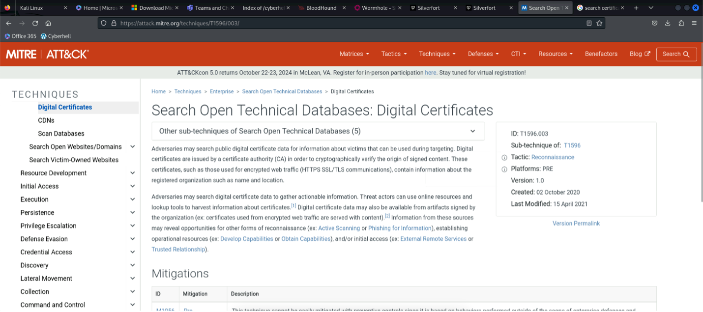
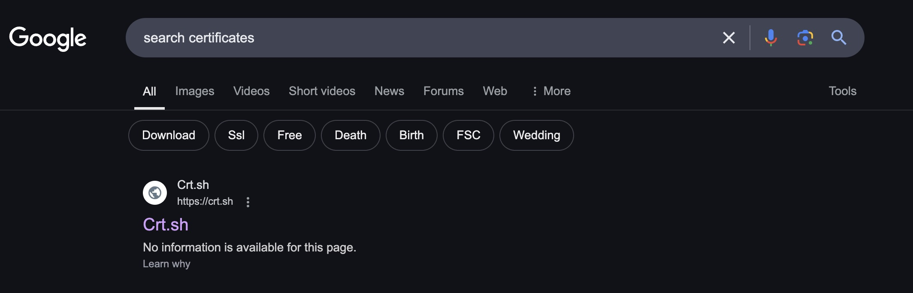
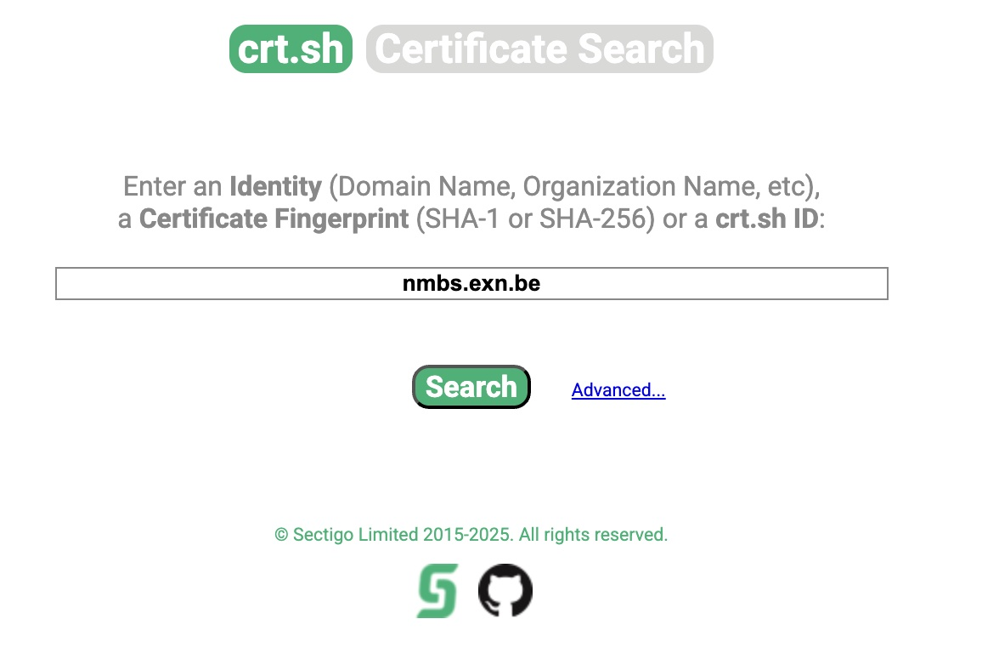
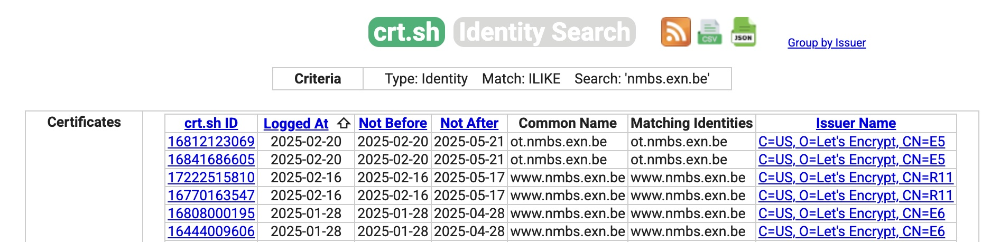
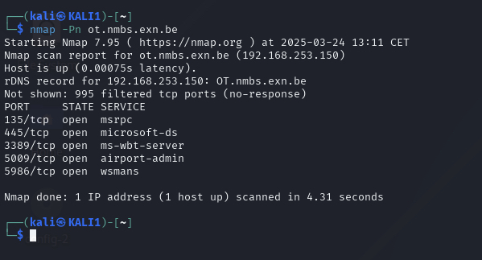
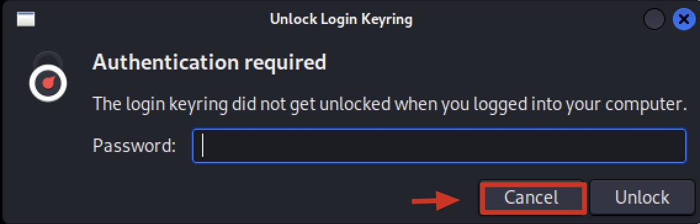
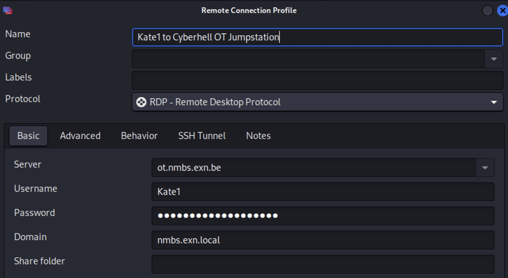
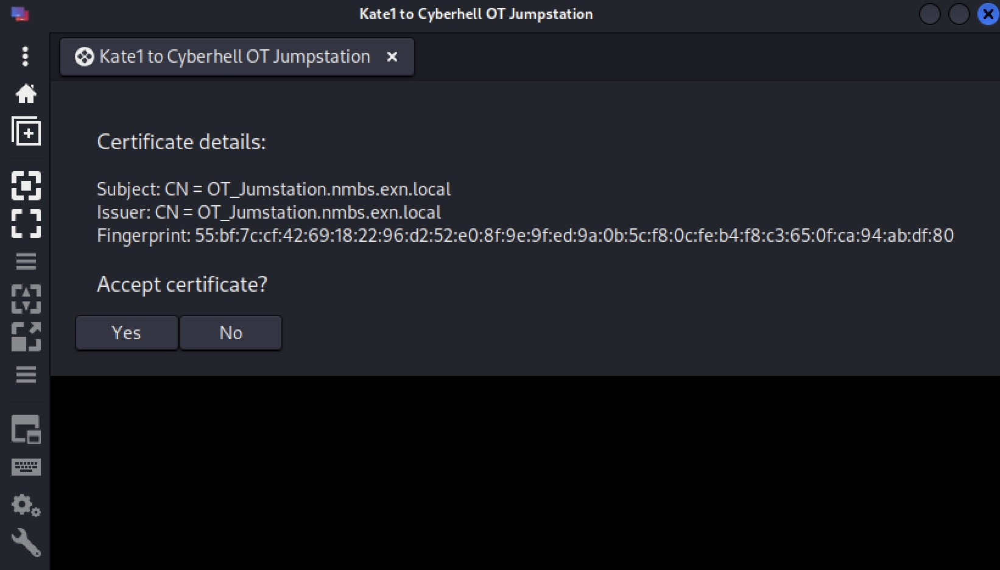
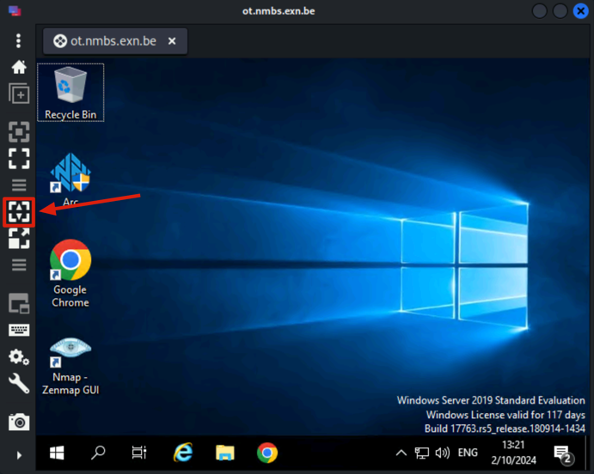

# Horce race

1. MITRE ATT&CK
    
    To begin your investigation, let's focus on the MITRE technique highlighted in the slide titled **"Search Open Technical Databases: Digital Certificates"**.

    This technique is crucial for gathering information about potential targets by analyzing **digital certificates**. By examining these certificates, we can uncover details about domain ownership, infrastructure, and other vital clues that could lead us to vulnerabilities within the target environment.

    

    When you read about this technique, you will see they say “Threat actors can use online resources and lookup tools to harvest information about certificates”. This is exactly what we are going to do.


1. On your Kali, open a **Google search** and type in `search certificates`

    Once the results load, let's simplify our process by selecting the very first site on the list. This should give us a straightforward entry point to begin our search for digital certificates.
    Let's proceed and see what information we can uncover using this method.

    
    <br>

1. Next, enter the **domain** we've been targeting throughout this entire operation.

    This step is crucial—by inputting the domain, we can pull up relevant certificates that may provide deeper insights into the infrastructure and potential vulnerabilities of our target.

    Proceed with caution, and let’s see what secrets this domain might reveal.

    Target domain: `nmbs.exn.be`

    

    This is exactly what we were hoping for—an abundance of information.
    The data from these certificates is revealing crucial details about the domain’s infrastructure, ownership, and more. Each piece of information could be a key to further unraveling the target's defenses.
    
    Let’s analyze this intel carefully and determine how best to use it in our ongoing mission.

    

---

**The next phase:**<br>
Let’s perform a targeted Nmap scan on this device. This scan will help us identify open ports, running services, and possible vulnerabilities that we can exploit.

Prepare your tools and initiate the scan—this is where we start to dig deeper into their defenses.
    

1. Initiate the Nmap scan on the target, use the following command on a new prompt on your Kali:

    ```
    nmap -Pn ot.nmbs.exn.be
    ```

    

    Cool, they left port `3389` open for us!<br> **It’s RDP-time for everyone!**


    <div class="purple">

    Remark: ok, you might have noticed we’re on an internal IP here, we did that on purpose. We are working in a contained environment in which we do not want to expose our lab to the world. In reality, the IP for `ot.nmbs.exn.be` would be public.
    </div>
    <br>


1. Start `Remmina`, which is an RDP tool which is already installed on your Kali Linux machine. 

    **When getting the pop-up “Authentication required”, click on “Cancel”**

    

1. Connect to `ot.nmbs.exn.be` on port `3389`:

   
    Use the **credentials** of `KateX` (replace `X` with your team number) that you created during the second phase of the operation. Also fill in the **Domain**: `nmbs.exn.local`.

    If for any reason you haven’t created this user, remember: failure is not an option. You must return to the previous steps and complete the task before proceeding.

    *Example for `Kate12`, Cyberhell password, Domain: `nmbs.exn.local`*

    

    - Accept the certificate warning by clicking on "Yes".

    

    
    <div class="purple">

    Remark: you can change the resolution of the RDP window by making the window bigger AND click on `toggle dynamic resolution update`.
    </div>

    
    
    Great work, we now have a stealthy connection to the jumpstation with our Kate user. Who will notice? Nobody! AND, no MFA!
