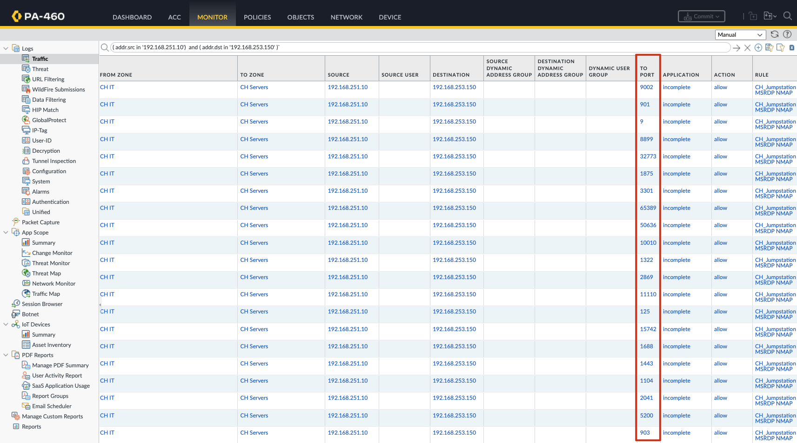
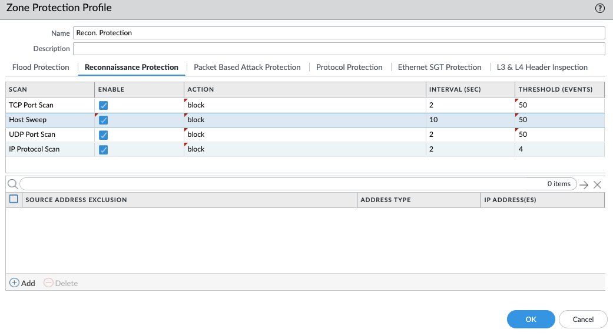
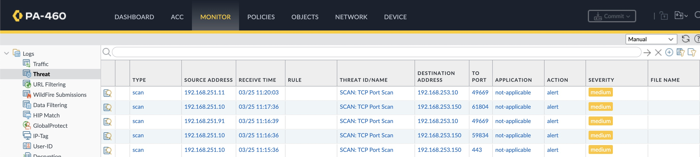

# Reconnaissance Protection

The attackers leveraged a common tool for network discovery and port scanning, a classic move in their infiltration playbook.

Now, it’s your turn to spot the threat. 

### PANW NGFW

Reviewing our Next-Generation Firewall (**NGFW**) logs clearly shows active port scanning. Within seconds, hundreds of ports were probed.

By applying a **Zone Protection Profile**, we can effectively block reconnaissance attacks like these with minimal effort.

