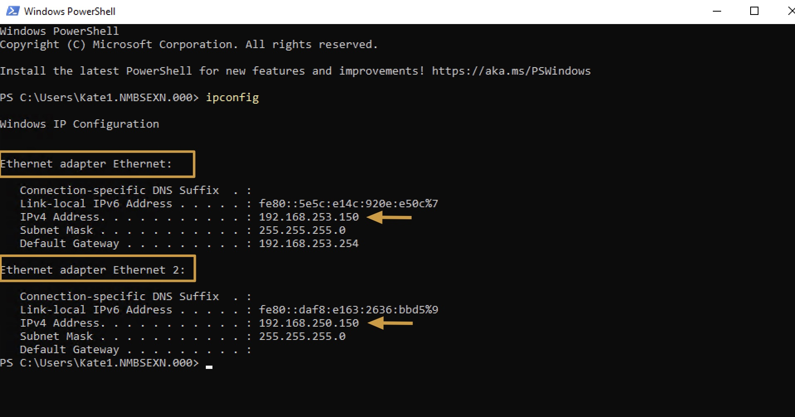
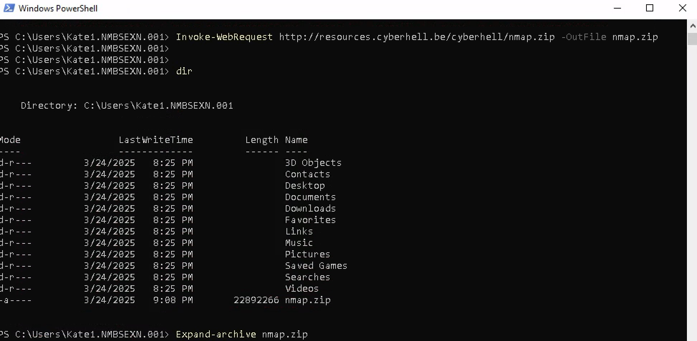
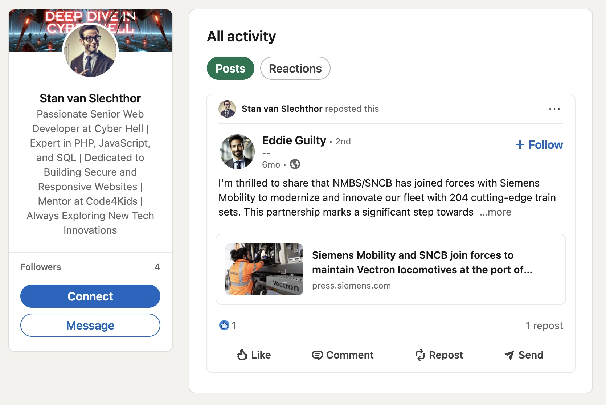
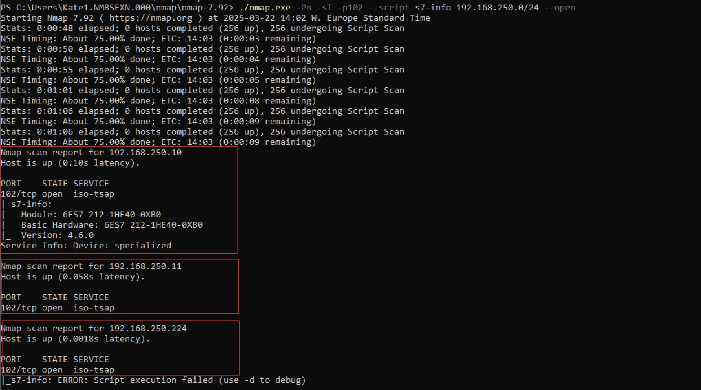

# WHERE IS THE TRAIN - ATTACKER

## Objective
- Investigate and gather key information about the network.
- Download and deploy a network scanning tool.

## Step by Step Guide

<div class="purple">

Use the RDP connection to the jumpstation, to find out some network details.
</div>


### Gather Network Information

1. Let’s start with figuring out the network details. Open a PS prompts and run ipconfig.


    ```
    ipconfig
    ```

    **Look at this, this machine has two interfaces!**


    


### Deploy NMAP

1. Let’s **scan** the **network** of the first interface `Ethernet`, `192.168.250.0/24`

    **Download nmap** using the following PowerShell command:

    ```
    Invoke-WebRequest http://resources.cyberhell.be/cyberhell/nmap.zip -OutFile nmap.zip
    ```


    **Unzip** `nmap.zip`

    ```
    Expand-archive nmap.zip
    ```

    


<div class="purple">

Let’s **not** just run nmap with default settings, that might be very noisy. 
</div>


1. **Figure out which material is running in the OT environment using OSINT.**

    Maybe **Stan** did mention something about this in his project communication, or on **social media**?

    

    Yes, **Siemens** might be a good start for our hunt!


1. Go to the nmap-7.92 folder where the nmap executable `nmap.exe` is located.

    ```
    cd nmap/nmap-7.92
    ```

<div class="purple">

Nmap comes with a bunch of scripts for detailed detection in the **scripts** folder (`nmap-7.92/scripts`). 

The `S7-info` script allows deeper detection of **Siemens PLC devices via S7 protocol**, running on `port 102`.
Our goal is to identify devices that communicate using `Siemens S7 Protocol` over `TCP:102`.
</div>

<div class="info">

**Port 102** is the default **TCP** port used by **Siemens S7 protocol**, which is commonly found in industrial control systems (**ICS**). This port is used to communicate between engineering software, **SCADA** systems, and Siemens **PLC**s (Programmable Logic Controllers).
</div>


1. Run the nmap command with the `S7-info` module against the network interface `Ethernet` we found in previous step:

    - **Target Network Interface:** `Ethernet`
    - **Target Network:** `192.168.250.0/24`

    **nmap command**:
    ```
    ./nmap.exe -Pn -sT -p102 --script s7-info 192.168.250.0/24 --open
    ```


1. **Wait for the output of the scan**.    
    
    

    Looks like we found ourselves a **PLC** device talking S7 on `192.168.250.10`.


    


