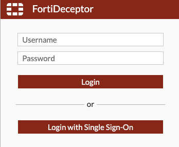
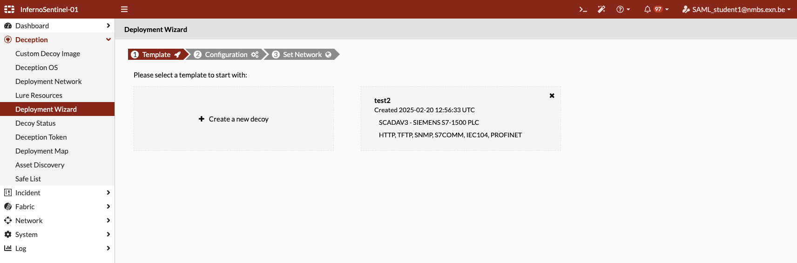
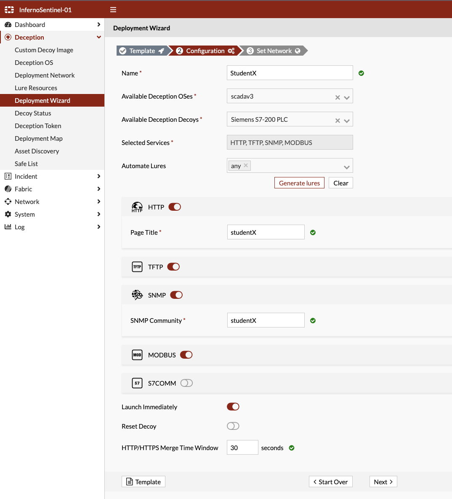
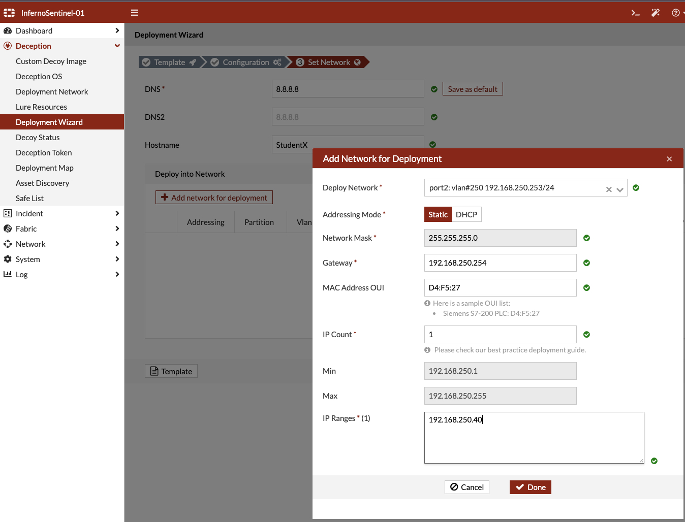
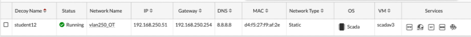

# Fortinet - FortiDeceptor

Now it’s your turn, Helldiver. Take the confusion to the next level by creating your own decoy. It’s time to strike back at the attackers and strengthen our defenses even further!

1.	Go to the [FortiDeceptor](https://fortideceptor.cyberhell.be/) and login with **Single Sign-On**

    URL: https://fortideceptor.cyberhell.be/

    
    
    

    
    Login to Thales SafeNet Trusted Access (IDP) using **student`X`** followed by your Domain Password and your One-Time-Password generated using your **Thales Harwarde OTP**.
    

    

Start by **deploying** your own **decoy**.

1. Head to the Deployment Wizard to launch your first decoy!

    Navigate to `Deception > Deployment Wizard`

    Click on `+ Create a new decoy`

    

1.  In the Configuration wizard you can craft the ultimate decoy of confusion! Ensure the information is as convincing and realistic as possible (this is a sample configuration, you don’t need to replicate this exactly)! 

    

1.	Add Network for Deployment

    In the final step, be sure to select the `OT subnet`, which is `VLAN 250`. 

    Click `Add Network for deployment`
    - Select network: `port2:vlan#250`
    - Enter Network Gateway IP: `192.168.250.254`
    - **Make sure IP Count is set to `1`**
    - Provide the IP address of your decoy under `IP Ranges`

    **Here are the IP addresses you can use to deploy your own decoy.** 

    - Student1: 192.168.250.40
    - Student2: 192.168.250.41
    - Student3: 192.168.250.42
    - Student4: 192.168.250.43
    - Student5: 192.168.250.44
    - Student6: 192.168.250.45
    - ....

    

    Remark: avoid choosing an IP address that’s already in use—we want to confuse the enemy, not ourselves.
    

    

    
1. Deploy decoy

    Now, ensure your decoy is fully operational and triggering alerts.
     
    

    

    

    

   
    

    

