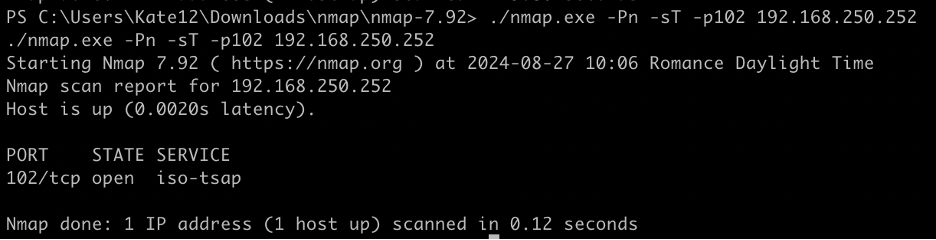

# TEST THE DEFENSE - ATTACKER

**Attacker**! go to your RDP session to the jumpstation

Run the `nmap` again

**Initiate your own Nmap scan on your decoy, but be careful—only scan the decoy, not the entire network, or you’ll put everyone on a false high alert.**

```
./nmap.exe -Pn -sT -p102 --script s7-info 192.168.250.XXX--open
```

*Where XXX is the IP address of the Decoy deployed by the Security team.*





