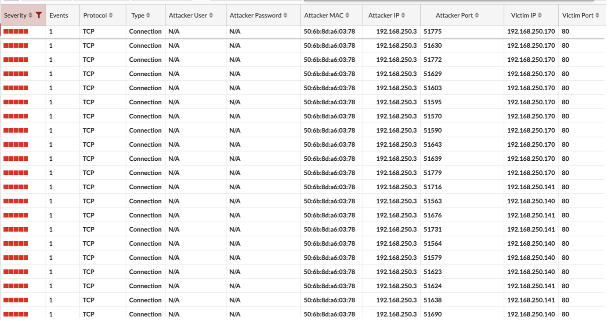

# TEST THE DEFENSE - DEFENDER

**Defender**: now, let's head back to our FortiDeceptor to see exactly what false information they've been fed!

1.	Go back to the [FortiDeceptor](https://fortideceptor.cyberhell.be/) UI

    URL: https://fortideceptor.cyberhell.be/

    Navigate to `Incident > Analysis`

1.	Analyze the logs

    

    As you can see over here, the nmap scan was detected! This means our decoy was successfully deployed and we have another tool to mislead our enemy.

 

Keep in mind that this network scan is also discovered by our other security solutions, such as the **Nozomi Networks Guardian**, our **NGFW's** and **PANW IoT Security**!

