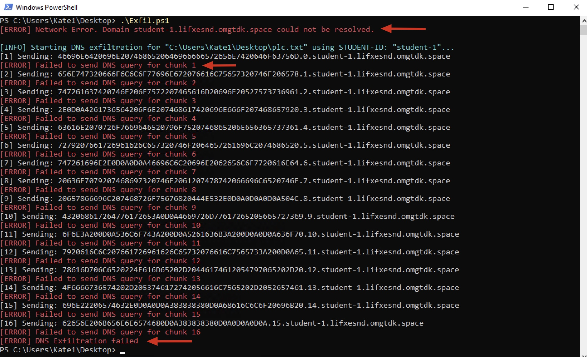

# Block DNS Exfiltration

It's time to reveal how we can **protect our environment against DNS exfiltration**.

You have **3** ways to protect yourself with Infoblox BloxOne:

1. **Infoblox BloxOne as Internal DNS server**
1. **Roaming Client**
1. Forward internal DNS to Infoblox BloxOne

Defenders, you will use option 1: **Infoblox BloxOne as Internal DNS server**.

At the end of the Activity, **an Instructor will demonstrate option 2** to protect Roaming Clients leveraging **Infoblox BloxOne Agent**. 

 

 

Please wait for the instructor to update the network configuration to direct DNS requests to the on-premise Infoblox BloxOne appliance.

 

---

### Attackers, repeat!

Attackers, run the `Exfil.ps1` one more time. 
Notice, the script will **Fail** to Exfiltrate the data over DNS.

---

### Defenders, do not fear!

As mentioned at the beginning of the workshop, we have much more powerful tools — if used correctly.

Behind the scenes, we forward all public DNS requests to our **Infoblox on-premise BloxOne appliance** in order to detect and block malicious DNS traffic.

1. Access the [Infoblox BloxOne Command Center](https://csp.infoblox.com/).

    On your computer, launch your browser and navigate to: https://csp.infoblox.com/

    Log in with:
    - Username: `eddieguilty@gmail.com`
    - Password: `L0v34Inf0Bl0x$!`

1. Review the **Security Events**

    - Go to `Monitor > Reports > Security > Security Activity > Security Events`

    - Change the Filter(s) to: `1 hour` and  `device_ip=192.168.253.150`

    

1. Analyze the **Malicious Traffic**

    - Review the **Indicators**

    

    - Click on the **Icon** near to the *Indicator* to view the details of the incident

    This will redirect to `Monitor/Research/Dossier`

    

1. Review the **DNS Security Rules and Policies**

    - Locate the **Cyberhell DNS Security Rule**
    - **Select** the Cyberhell Rule
    - Click **Edit** to review the Security Polies

    

---

In this activity, we reviewed how **Infoblox BloxOne** can protect our organization against malicious DNS traffic using an **agentless** approach.

**Infoblox** also offers an **agent-based** DNS Security solution for **off-premises endpoints** and many other use cases.

### Infoblox Agent

**An Instructor will demonstrate option 2** to protect Roaming Clients leveraging **Infoblox BloxOne Agent**. 

Optional: when using the Infoblox BloxOne Agent we get more context about the source device. Traffic is sent from the endpoint directly to Infoblox BloxOne Cloud.

