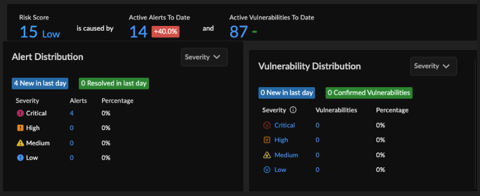
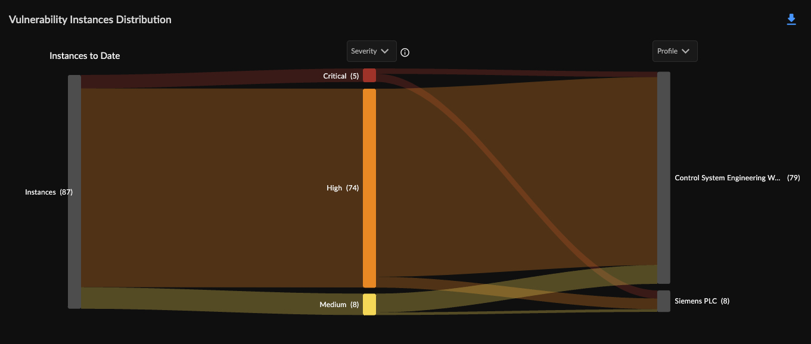
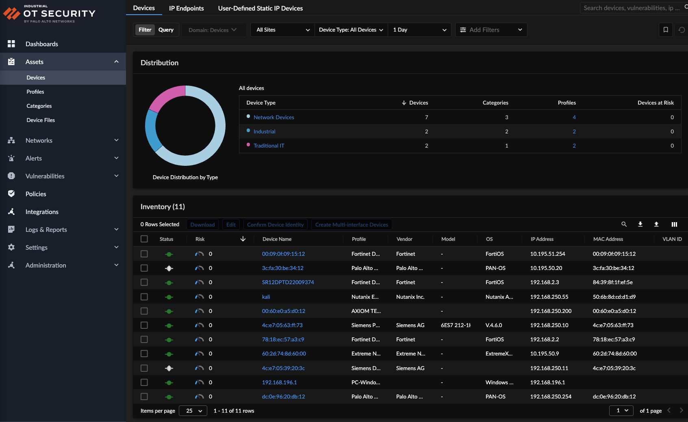
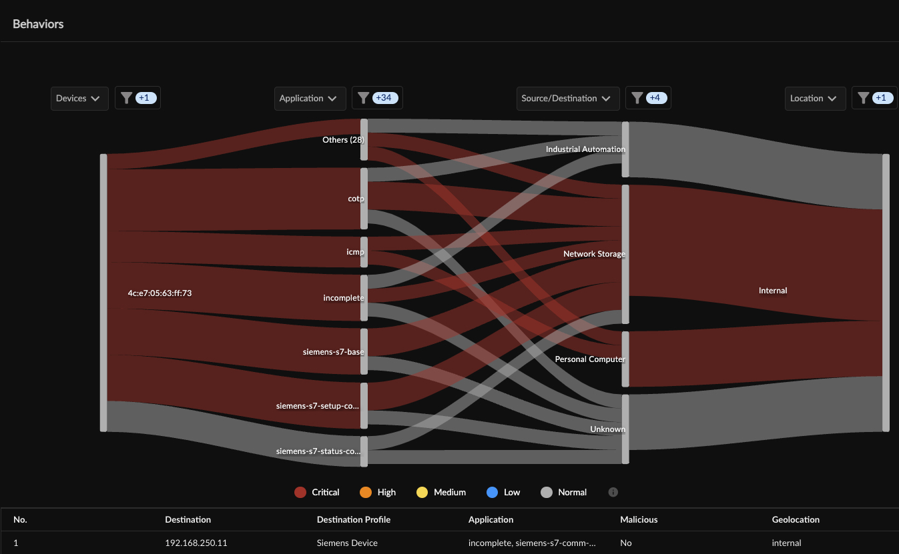
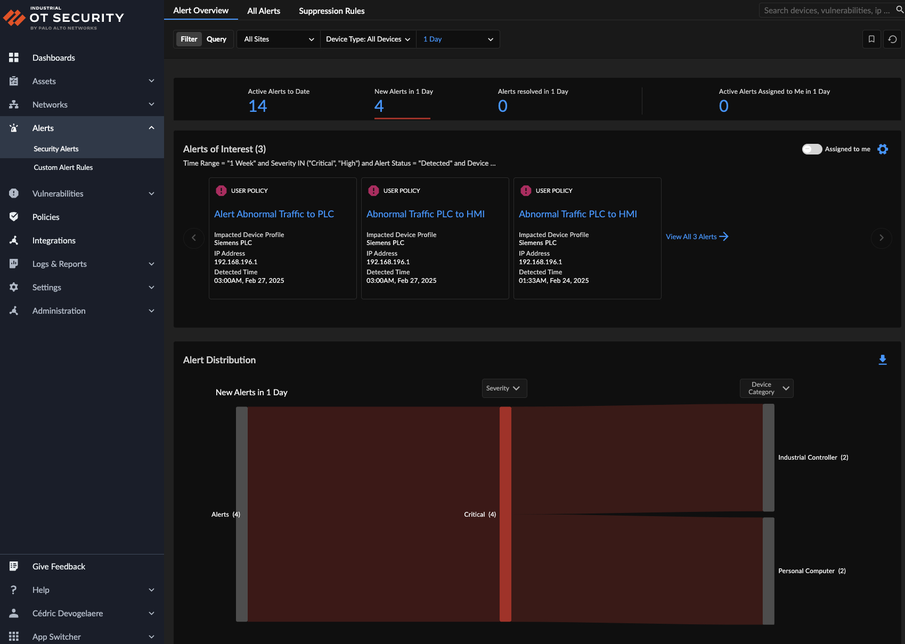

# Palo Alto Networks IoT Security

1. Connect to the IoT Security Platform.

1. Review Top Risk and Vulnerabilities, displayed on the Dashboard

    - **Risk Score**
    

    - **Vulnerabilites**
    

1. Go to the `Assets tab` to review all `Devices` observed on the Network

    

1. Click on a Device to get more details.

1. Review the Network Traffic by taking a look at the `Traffic Flow tab`

    

1. Go to the `Alerts tab` to observer the malicious/abnormal traffic detect by IoT Security.

    

1. Click on an Alert to get more details