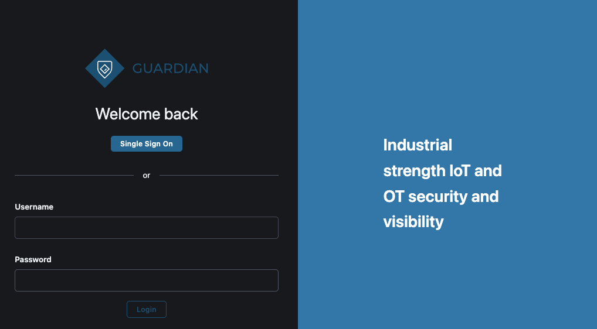
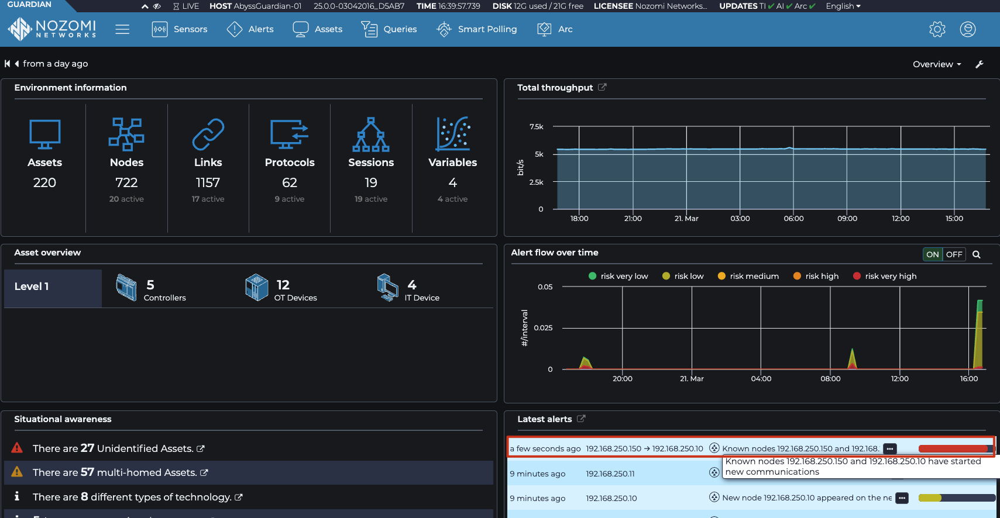
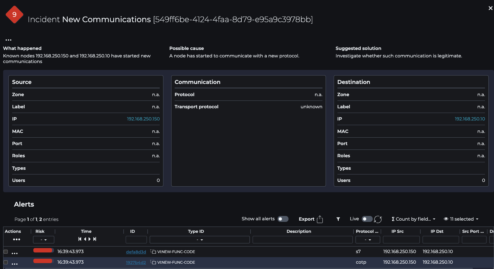
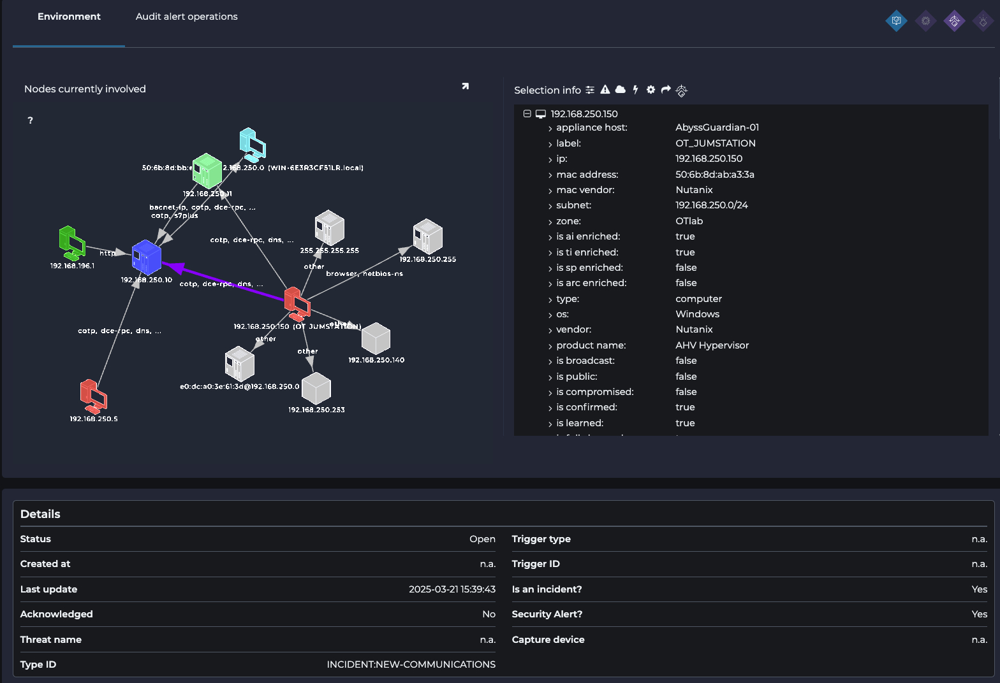

# Nozomi 

The attackers leveraged a common tool for network discovery and port scanning, a classic move in their infiltration playbook.

Now, it’s your turn to spot the threat. On the **Nozomi Guardian** appliance, investigate and identify an alert similar to the one shown below:

# Nozomi Guardian Platform
 
1. Access the Platform [Nozomi Guardian Platform](https://192.168.250.200/)
 
    **URL:** https://192.168.250.200/
    
    
 
 
    Login using **Single Sign-On (SSO)**.  
    Use your **studentX account** and your **Hardware OTP** to authenticate.
    
 
1. Once logged in, you will see a dashboard providing an overview of the monitored environment.
    
    Key Dashboard Elements
    
    - Number of **assets**, **nodes**, **links**, **protocols**, **sessions**, and **variables**
    - A list of the **latest alerts**
    - **Total throughput** being sent to the Guardian
    - **Situational awareness** (e.g., links to the internet, devices that are both in IT and OT domains)
 
    

    

    

1. What to Look For?
 
    Pay special attention to:
    
    - **Assets**, **nodes**, **links**, **protocols**, **sessions**, and **variables**
    - **Latest alerts**, especially those marked **critical**
    - **Total throughput** to the Guardian
    - **Anomalies**, such as:
    - Unexpected internet links
    - Devices operating in both IT and OT
    - Assets communicating across different **Purdue levels**
 
1. Investigating the Hack
    
    The **hack has triggered an alert** in the Guardian, which can also be viewed in **Nozomi Vantage**.
    
    - Navigate to the **Alerts** section.
    - Look for an alert indicating **malicious_s7** traffic.
    - Ensure **"Group by Incident"** is enabled.  
    This groups multiple alerts from the same node into one incident.

     
    
    > 💡 **Example:**  
    > A new node is detected.  
    > It performs an **nmap scan**, then executes the hack.  
    > Each step generates a different alert, but they can be grouped as one **incident**.
    
    Clicking on the alert allows you to view **the originating device** of the suspicious traffic.

    